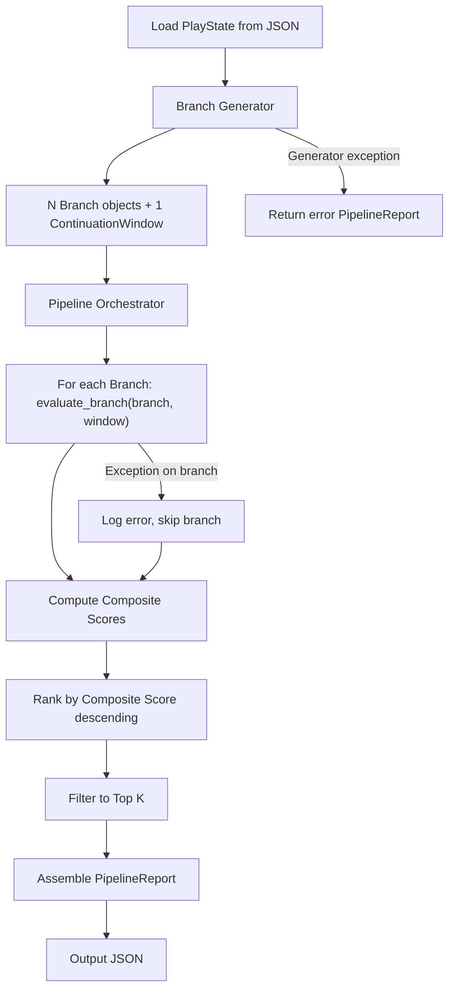
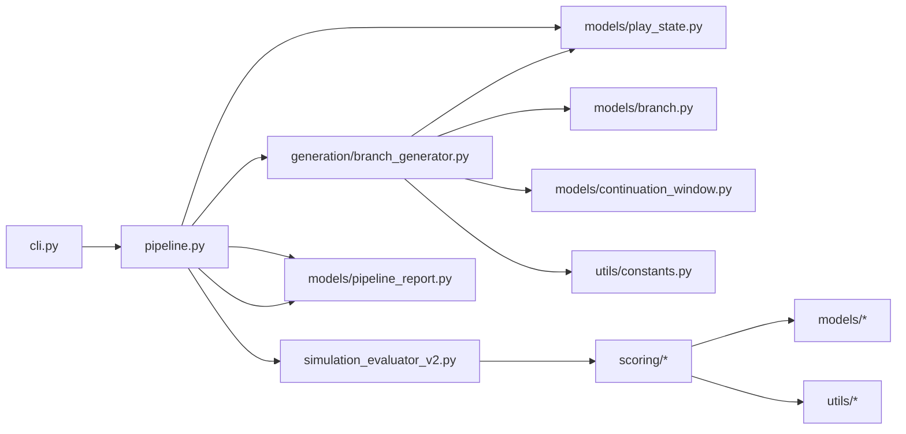

# Design Document: Branch Generation Pipeline

## Overview

This design describes the branch generation pipeline — the first end-to-end integration of branch generation with the existing v3 simulation evaluator. The pipeline takes a `PlayState` (a snapshot of a football game situation at a decision point), generates 10–30 alternative `Branch` objects using rule-based perturbation strategies with seeded randomness, evaluates each branch through the existing evaluator, ranks branches by a composite score, filters to the top K, and exports a structured `PipelineReport` as JSON.

The pipeline introduces four new modules:

1. **PlayState model** (`src/models/play_state.py`) — Structured input representing a game situation.
2. **Branch Generator** (`src/generation/branch_generator.py`) — Produces N branches from a PlayState using three perturbation strategies (route variation, speed variation, decision variation) and synthesizes a ContinuationWindow baseline.
3. **Pipeline Orchestrator** (`src/pipeline.py`) — Coordinates generation → evaluation → ranking → filtering → report assembly with graceful error handling.
4. **PipelineReport model** (`src/models/pipeline_report.py`) — Structured output containing all pipeline results.

Key design constraints:
- Deterministic generation via seeded `random.Random` instance (no global state).
- Rule-based only — no ML dependencies.
- At least 70% of generated branches should pass the evaluator's gating checks.
- Full pipeline completes in < 10 seconds for N=20 branches.
- All output is JSON-serializable.
- Generation modules live under `src/generation/`; pipeline orchestrator at `src/pipeline.py`.

## Architecture

### Pipeline Flow



### Layer Separation

| Layer | Location | Responsibility |
|-------|----------|----------------|
| Models | `src/models/play_state.py`, `src/models/pipeline_report.py` | PlayState and PipelineReport dataclasses |
| Generation | `src/generation/branch_generator.py` | Branch generation with perturbation strategies, ContinuationWindow synthesis |
| Orchestration | `src/pipeline.py` | Pipeline coordination, error handling, ranking, filtering |
| Evaluation | `src/simulation_evaluator_v2.py` (existing) | Branch scoring via `evaluate_branch` |
| CLI | `src/cli.py` | Command-line entry point |
| Data | `data/play_states/` | Demo PlayState JSON files |
| Tests | `tests/generation/`, `tests/` | Unit and property tests |

### Module Dependency Graph



The generation module (`src/generation/`) imports from `src/models/` and `src/utils/` only. It does not import from `src/scoring/` or `src/simulation_evaluator_v2.py`. The pipeline orchestrator is the sole composition point that wires generation to evaluation.

## Components and Interfaces

### 1. PlayState Model — `src/models/play_state.py`

Represents a football game situation at a decision point. Reuses the existing `PlayerPosition` dataclass from `src/models/branch.py`.

```python
from dataclasses import dataclass, field
from src.models.branch import PlayerPosition

@dataclass
class PlayState:
    """Snapshot of a football game situation at a decision point.

    Attributes:
        field_position: Yards from own end zone (0–100).
        down: Current down (1–4).
        distance: Yards to first down.
        score_differential: Own score minus opponent score.
        game_clock: Seconds remaining in the game.
        player_positions: Player positions at the decision point.
        decision_point_timestamp: Seconds from play start anchoring divergence.
        player_roles: Mapping of player_id to role string (e.g. "QB", "WR").
        metadata: Optional additional context (formation, weather, etc.).
    """
    field_position: float
    down: int
    distance: float
    score_differential: int
    game_clock: float
    player_positions: list[PlayerPosition]
    decision_point_timestamp: float
    player_roles: dict[str, str] = field(default_factory=dict)
    metadata: dict = field(default_factory=dict)
```

**Serialization helpers** (in the same file):

```python
def play_state_to_dict(ps: PlayState) -> dict:
    """Convert a PlayState to a JSON-serializable dict via dataclasses.asdict()."""

def dict_to_play_state(data: dict) -> PlayState:
    """Reconstruct a PlayState from a JSON-deserialized dict.

    Raises:
        KeyError: If required fields are missing.
        TypeError: If field types are wrong.
    """
```

The `dict_to_play_state` function reconstructs nested `PlayerPosition` objects from their dict representations.

### 2. Branch Generator — `src/generation/branch_generator.py`

Produces N branches from a PlayState using three perturbation strategies and synthesizes a ContinuationWindow.

```python
import random
from dataclasses import dataclass, field

@dataclass
class GenerationResult:
    """Output of the branch generator.

    Attributes:
        branches: List of generated Branch dicts.
        continuation_window: Synthesized ContinuationWindow dict.
        strategy_counts: How many branches used each strategy.
    """
    branches: list[dict]
    continuation_window: dict
    strategy_counts: dict[str, int] = field(default_factory=dict)


def generate_branches(
    play_state: PlayState,
    n: int = 20,
    seed: int = 42,
) -> GenerationResult:
    """Generate N branches from a PlayState using seeded RNG.

    Uses a local random.Random(seed) instance — no global state mutation.
    Distributes branches across three perturbation strategies in a
    round-robin pattern to ensure strategy diversity.

    Args:
        play_state: The game situation to branch from.
        n: Number of branches to generate (10–30).
        seed: RNG seed for deterministic output.

    Returns:
        GenerationResult with N branches and one ContinuationWindow.

    Raises:
        ValueError: If n is outside [10, 30].
    """
```

#### Perturbation Strategies

Each strategy takes the PlayState's player positions and roles as a base, then applies controlled random modifications using the seeded RNG instance.

**Strategy 1: Route Variation**
- Modifies player movement directions by rotating position deltas by a random angle drawn from `[-MAX_ROUTE_ANGLE_DELTA, +MAX_ROUTE_ANGLE_DELTA]` radians.
- Generates 3–5 position snapshots per player at `GENERATION_TIMESTEP` intervals starting from `decision_point_timestamp`.
- Base movement direction is derived from the player's role (WR → downfield, RB → lateral/forward, QB → pocket movement).
- Keeps speeds within `MAX_HUMAN_SPRINT_SPEED * SPEED_SAFETY_FACTOR` to ensure gating compliance.

**Strategy 2: Speed Variation**
- Keeps movement directions from the base PlayState but scales player speeds by a random factor drawn from `[MIN_SPEED_FACTOR, MAX_SPEED_FACTOR]`.
- Each player gets an independent speed factor.
- Clamps resulting speeds to `MAX_HUMAN_SPRINT_SPEED * SPEED_SAFETY_FACTOR`.

**Strategy 3: Decision Variation**
- Alters the event sequence: e.g., changes a "handoff" to a "throw" + "catch", or removes a turnover event.
- Adjusts player positions to be consistent with the altered events (e.g., if a pass replaces a run, the WR moves downfield while the RB stays in the backfield).
- Generates plausible event timestamps based on the decision point.

#### Strategy Distribution

Branches are assigned strategies in round-robin order: `[route, speed, decision, route, speed, decision, ...]`. This guarantees at least `floor(N/3)` branches per strategy and ensures the mix requirement (Req 3.2).

#### Branch Construction

Each generated branch is a dict conforming to the existing `Branch` dataclass structure:

```python
{
    "branch_id": "gen-001",  # sequential, zero-padded
    "decision_point_timestamp": play_state.decision_point_timestamp,
    "positions": [...],       # list of PlayerPosition dicts
    "events": [...],          # list of EventMarker dicts
    "player_roles": {...},    # copied from PlayState
    "metadata": {
        "strategy": "route_variation",  # which strategy produced this
        "seed": 42,
        "source": "branch_generator"
    }
}
```

#### Gating Compliance

To meet the 70% gating pass rate requirement:
- All generated positions are clamped to field boundaries `[0, FIELD_WIDTH] × [-END_ZONE_DEPTH, FIELD_LENGTH + END_ZONE_DEPTH]`.
- Speeds are capped at `MAX_HUMAN_SPRINT_SPEED * SPEED_SAFETY_FACTOR` (where `SPEED_SAFETY_FACTOR = 0.85`).
- Timestamps are generated at fixed `GENERATION_TIMESTEP = 0.2` second intervals, well within `MAX_TIMESTAMP_GAP = 0.5`.

#### ContinuationWindow Synthesis

```python
def synthesize_continuation_window(
    play_state: PlayState,
    rng: random.Random,
) -> dict:
    """Synthesize a ContinuationWindow from a PlayState.

    Creates a baseline "what actually happened" window with:
    - window_id: "synth-cw-001"
    - decision_point_timestamp: matching PlayState
    - One outcome with positions derived from PlayState player_positions
      projected forward with small random deltas, plus plausible
      yard_gain, turnover (False), and scoring_play (False) fields.

    Args:
        play_state: Source game situation.
        rng: Seeded Random instance.

    Returns:
        ContinuationWindow as a plain dict.
    """
```

The synthesized window projects each player forward by 2–3 timesteps with small, physically plausible movements. The `yard_gain` is derived from the average forward (y-axis) displacement of the ball carrier or QB. `turnover` and `scoring_play` default to `False` for the baseline.

### 3. Pipeline Orchestrator — `src/pipeline.py`

Single entry point that wires generation → evaluation → ranking → filtering → report.

```python
from dataclasses import dataclass, field

@dataclass
class PipelineConfig:
    """Configuration for the pipeline orchestrator.

    Attributes:
        n: Number of branches to generate (10–30). Default 20.
        k: Number of top branches to keep. Default 5.
        seed: RNG seed for deterministic generation. Default 42.
        validity_weight: Weight for validity_score in composite. Default 0.5.
        opportunity_weight: Weight for opportunity_score in composite. Default 0.5.
    """
    n: int = 20
    k: int = 5
    seed: int = 42
    validity_weight: float = 0.5
    opportunity_weight: float = 0.5


def run_pipeline(
    play_state: PlayState,
    config: PipelineConfig | None = None,
) -> PipelineReport:
    """Execute the full branch generation and evaluation pipeline.

    Steps:
      1. Generate N branches + ContinuationWindow from PlayState.
      2. Evaluate each branch via evaluate_branch(branch, window).
      3. Compute composite score for each evaluated branch.
      4. Rank by composite score descending (branch_id tiebreaker).
      5. Filter to top K branches that passed gating.
      6. Assemble and return PipelineReport.

    Error handling:
      - If a single branch evaluation raises, skip it and log the error.
      - If all branches fail, return report with empty ranked list.
      - If the generator itself raises, return error report.
      - Never raises an unhandled exception.

    Args:
        play_state: The game situation to analyze.
        config: Optional pipeline configuration overrides.

    Returns:
        PipelineReport with all results.
    """
```

#### Composite Score Computation

```python
def compute_composite_score(
    report: EvaluationReport,
    validity_weight: float,
    opportunity_weight: float,
) -> float:
    """Compute weighted composite score.

    composite = validity_weight * validity_score + opportunity_weight * opportunity_score

    Args:
        report: Evaluation report for a branch.
        validity_weight: Weight for validity component.
        opportunity_weight: Weight for opportunity component.

    Returns:
        Composite score as a float.
    """
```

#### Ranking Logic

1. Compute composite score for every evaluated branch.
2. Sort by composite score descending.
3. Tiebreaker: `branch_id` lexicographic ascending.
4. Select top K branches from those that passed gating.
5. If fewer than K branches passed gating, return only those that passed (no padding).

### 4. PipelineReport Model — `src/models/pipeline_report.py`

```python
from dataclasses import dataclass, field

@dataclass
class RankedBranch:
    """A branch with its composite score for ranking.

    Attributes:
        branch_id: Identifier of the branch.
        composite_score: Weighted combination of validity and opportunity.
        evaluation_report: Full evaluation report dict.
        branch: The original branch dict.
    """
    branch_id: str
    composite_score: float
    evaluation_report: dict
    branch: dict


@dataclass
class PipelineReport:
    """Complete output of the branch generation pipeline.

    Attributes:
        play_state: The input PlayState as a dict.
        evaluated_branches: All generated branches paired with evaluation reports.
        ranked_branches: Top K branches sorted by composite score.
        metadata: Generation metadata (seed, n, k, gating_pass_count, execution_time_seconds).
        errors: List of error messages from branch-level or generator-level failures.
    """
    play_state: dict
    evaluated_branches: list[dict]
    ranked_branches: list[RankedBranch]
    metadata: dict = field(default_factory=dict)
    errors: list[str] = field(default_factory=list)

    def to_dict(self) -> dict:
        """Convert to a JSON-serializable dict.

        Returns:
            Plain dict suitable for json.dumps().
        """

    @classmethod
    def from_dict(cls, data: dict) -> "PipelineReport":
        """Reconstruct a PipelineReport from a JSON-deserialized dict.

        Args:
            data: Dict previously produced by to_dict().

        Returns:
            Reconstructed PipelineReport.
        """
```

The `metadata` dict contains:
- `seed`: int — RNG seed used.
- `n_generated`: int — number of branches generated.
- `k_requested`: int — number of top branches requested.
- `gating_pass_count`: int — number of branches that passed gating.
- `execution_time_seconds`: float — total pipeline wall-clock time.
- `strategy_counts`: dict — branches per perturbation strategy.

### 5. CLI Entry Point — `src/cli.py`

```python
def main() -> None:
    """CLI entry point for the branch generation pipeline.

    Usage:
        python -m src.cli <play_state.json> [options]

    Arguments:
        play_state_path: Path to a PlayState JSON file.

    Options:
        --n INT              Number of branches to generate (default: 20)
        --k INT              Number of top branches to keep (default: 5)
        --seed INT           RNG seed (default: 42)
        --validity-weight FLOAT   Validity weight (default: 0.5)
        --opportunity-weight FLOAT  Opportunity weight (default: 0.5)
        --output PATH        Write report to file instead of stdout

    Errors:
        Prints descriptive message to stderr and exits with code 1
        if the input file is missing or malformed.
    """
```

Uses `argparse` from the standard library. Loads the PlayState JSON, constructs a `PipelineConfig`, calls `run_pipeline`, and writes the `PipelineReport.to_dict()` as formatted JSON.

### 6. Generation Constants — `src/utils/constants.py` (additions)

```python
# --- Branch Generation ---
GENERATION_TIMESTEP: float = 0.2          # seconds between generated position snapshots
SPEED_SAFETY_FACTOR: float = 0.85         # fraction of MAX_HUMAN_SPRINT_SPEED for generation
MAX_ROUTE_ANGLE_DELTA: float = 0.8        # radians (~45°) max route deviation
MIN_SPEED_FACTOR: float = 0.3             # minimum speed scaling factor
MAX_SPEED_FACTOR: float = 1.0             # maximum speed scaling factor (1.0 = full safe speed)
GENERATION_SNAPSHOTS_MIN: int = 3         # minimum position snapshots per player per branch
GENERATION_SNAPSHOTS_MAX: int = 5         # maximum position snapshots per player per branch
DEFAULT_N: int = 20                       # default number of branches to generate
DEFAULT_K: int = 5                        # default top-K branches to keep
DEFAULT_SEED: int = 42                    # default RNG seed
DEFAULT_VALIDITY_WEIGHT: float = 0.5      # default composite score validity weight
DEFAULT_OPPORTUNITY_WEIGHT: float = 0.5   # default composite score opportunity weight
```

## Data Models

### PlayState (new)

See Section 1 above. Fields: `field_position`, `down`, `distance`, `score_differential`, `game_clock`, `player_positions` (list of `PlayerPosition`), `decision_point_timestamp`, `player_roles` (dict), `metadata` (dict).

### PipelineConfig (new)

See Section 3 above. Fields: `n`, `k`, `seed`, `validity_weight`, `opportunity_weight`. All have defaults.

### RankedBranch (new)

See Section 4 above. Fields: `branch_id`, `composite_score`, `evaluation_report` (dict), `branch` (dict).

### PipelineReport (new)

See Section 4 above. Fields: `play_state` (dict), `evaluated_branches` (list of dicts), `ranked_branches` (list of `RankedBranch`), `metadata` (dict), `errors` (list of str).

### Existing Models (unchanged)

- `Branch`, `PlayerPosition`, `EventMarker` — used as-is from `src/models/branch.py`.
- `ContinuationWindow` — used as-is from `src/models/continuation_window.py`.
- `EvaluationReport`, `SubMetrics` — used as-is from `src/models/evaluation_report.py`.
- `EvaluatorConfig` — used as-is from `src/models/config.py`.

### Demo PlayState Files — `data/play_states/`

Three JSON files covering distinct scenarios:

1. **`first_and_ten_midfield.json`** — 1st-and-10 at the 50-yard line. Balanced situation with 5+ players, moderate game clock.
2. **`third_and_short_goal_line.json`** — 3rd-and-2 at the opponent's 5-yard line. Goal-line scenario with compressed field space.
3. **`second_and_long_after_sack.json`** — 2nd-and-15 at own 20 after a sack. Long-yardage recovery scenario.

Each file contains a valid PlayState JSON object with at least 5 player positions within field boundaries, appropriate roles, and realistic game context in metadata.


## Correctness Properties

*A property is a characteristic or behavior that should hold true across all valid executions of a system — essentially, a formal statement about what the system should do. Properties serve as the bridge between human-readable specifications and machine-verifiable correctness guarantees.*

### Property 1: PlayState round-trip serialization

*For any* valid PlayState object, serializing via `play_state_to_dict`, converting to JSON via `json.dumps`, deserializing via `json.loads`, and reconstructing via `dict_to_play_state` SHALL produce a PlayState equivalent to the original.

**Validates: Requirements 1.5, 1.6, 12.1, 12.3, 12.4**

### Property 2: Generator produces exactly N branches

*For any* valid PlayState and any N in [10, 30], calling `generate_branches(play_state, n=N, seed=s)` SHALL return a GenerationResult containing exactly N branches.

**Validates: Requirements 2.1**

### Property 3: Deterministic generation with same seed

*For any* valid PlayState, N, and seed, calling `generate_branches` twice with the same arguments SHALL produce identical branch lists (same branch_ids, positions, events, and metadata).

**Validates: Requirements 2.3**

### Property 4: Different seeds produce different output

*For any* valid PlayState and N, calling `generate_branches` with two distinct seeds SHALL produce at least one differing branch across the two result sets.

**Validates: Requirements 2.4**

### Property 5: Unique sequential branch IDs

*For any* generation run, all branch_ids in the result SHALL be unique and SHALL match the pattern `gen-NNN` where NNN is a zero-padded sequential index starting from 001.

**Validates: Requirements 2.5**

### Property 6: Decision point timestamps match PlayState

*For any* valid PlayState, every generated branch's `decision_point_timestamp` and the synthesized ContinuationWindow's `decision_point_timestamp` SHALL equal the PlayState's `decision_point_timestamp`.

**Validates: Requirements 2.6, 4.2**

### Property 7: At least three perturbation strategies used

*For any* generation run with N ≥ 3, the GenerationResult's `strategy_counts` SHALL contain at least three distinct strategy keys, and no single strategy SHALL account for all N branches.

**Validates: Requirements 3.1, 3.2**

### Property 8: Generated branches conform to Branch structure

*For any* generated branch, it SHALL contain the keys `branch_id`, `decision_point_timestamp`, `positions`, `events`, `player_roles`, and `metadata`, where `positions` is a non-empty list of dicts each having `player_id`, `x`, `y`, `timestamp` keys.

**Validates: Requirements 3.3**

### Property 9: Generated timestamps are ordered with valid gaps

*For any* generated branch, for each player's positions sorted by timestamp, consecutive timestamps SHALL be in strictly increasing order and the gap between consecutive timestamps SHALL not exceed MAX_TIMESTAMP_GAP (0.5 seconds).

**Validates: Requirements 3.4**

### Property 10: At least 70% of generated branches have gating-compliant speeds

*For any* generation run, at least 70% of the generated branches SHALL have all player speeds (computed from consecutive position pairs) at or below MAX_HUMAN_SPRINT_SPEED (12.0 yards/second).

**Validates: Requirements 3.5**

### Property 11: Synthesized ContinuationWindow is well-formed

*For any* valid PlayState, the synthesized ContinuationWindow SHALL contain a `window_id`, a `decision_point_timestamp`, at least one outcome with `positions`, `yard_gain`, `turnover`, and `scoring_play` fields, and a `metadata` dict.

**Validates: Requirements 4.1, 4.3, 4.4**

### Property 12: Composite score equals weighted sum

*For any* EvaluationReport with validity_score `v` and opportunity_score `o`, and any non-negative weights `wv` and `wo`, the composite score SHALL equal `wv * v + wo * o`.

**Validates: Requirements 6.1**

### Property 13: Ranking is descending by composite score with branch_id tiebreaker

*For any* list of evaluated branches with composite scores, the ranked output SHALL be sorted in descending order by composite score, and for branches with equal composite scores, sorted in ascending lexicographic order by branch_id.

**Validates: Requirements 6.2, 6.3**

### Property 14: Pipeline never raises unhandled exceptions

*For any* input (valid PlayState, invalid PlayState, or None), calling `run_pipeline` SHALL return a PipelineReport and SHALL NOT raise an unhandled exception.

**Validates: Requirements 7.4**

### Property 15: PipelineReport round-trip serialization

*For any* valid PipelineReport, calling `to_dict()`, converting to JSON via `json.dumps`, deserializing via `json.loads`, and reconstructing via `PipelineReport.from_dict()` SHALL produce a PipelineReport equivalent to the original.

**Validates: Requirements 8.5, 8.6**

### Property 16: PlayState parser rejects invalid dicts with descriptive errors

*For any* dict with a random subset of required PlayState fields removed, calling `dict_to_play_state` SHALL raise an exception, and the error message or exception type SHALL identify the missing fields.

**Validates: Requirements 12.2**

## Error Handling

### Branch Generator Errors

| Condition | Behavior |
|-----------|----------|
| N outside [10, 30] | `generate_branches` raises `ValueError` with descriptive message. Pipeline orchestrator catches and returns error PipelineReport. |
| PlayState with empty player_positions | Generator produces branches with no player movement data. Branches will likely fail evaluation but generation itself succeeds. |
| PlayState with invalid field_position (< 0 or > 100) | Generator does not validate PlayState semantics — it generates branches using the provided data. Evaluation will catch implausible positions. |

### Pipeline Orchestrator Errors

| Condition | Behavior |
|-----------|----------|
| Single branch evaluation raises exception | Pipeline skips that branch, appends error message to `PipelineReport.errors`, continues with remaining branches. |
| All branches fail evaluation | Pipeline returns PipelineReport with empty `ranked_branches`, populated `errors`, and explanatory message in `metadata`. |
| Branch generator raises exception | Pipeline catches the exception, returns PipelineReport with empty `evaluated_branches` and `ranked_branches`, error message in `errors` and `metadata`. |
| Invalid PipelineConfig (e.g., n=0) | Pipeline catches ValueError from generator, returns error PipelineReport. |
| None or non-PlayState input | Pipeline wraps in try/except, returns error PipelineReport with descriptive message. |

### CLI Errors

| Condition | Behavior |
|-----------|----------|
| File path does not exist | Print "Error: File not found: {path}" to stderr, exit code 1. |
| File contains invalid JSON | Print "Error: Invalid JSON in {path}: {details}" to stderr, exit code 1. |
| JSON missing required PlayState fields | Print "Error: Invalid PlayState: missing fields {fields}" to stderr, exit code 1. |
| --output path not writable | Print "Error: Cannot write to {path}: {details}" to stderr, exit code 1. |

### PlayState Serialization Errors

| Condition | Behavior |
|-----------|----------|
| `dict_to_play_state` receives dict missing required fields | Raises `KeyError` identifying the missing field. |
| `dict_to_play_state` receives dict with wrong types | Raises `TypeError` with descriptive message. |
| `play_state_to_dict` on valid PlayState | Always succeeds (uses `dataclasses.asdict()`). |

### General Principles

- The pipeline orchestrator is the single error-handling boundary. It never propagates exceptions to the caller.
- Every error path produces a human-readable message in the PipelineReport's `errors` list.
- Error-state PipelineReports are still valid JSON and conform to the PipelineReport schema.
- The CLI translates pipeline errors into stderr messages and non-zero exit codes.

## Testing Strategy

### Test Organization

| Source | Test File | Type |
|--------|-----------|------|
| `src/models/play_state.py` | `tests/models/test_play_state.py` | Unit |
| `src/models/play_state.py` | `tests/models/test_play_state_properties.py` | Property |
| `src/models/pipeline_report.py` | `tests/models/test_pipeline_report.py` | Unit |
| `src/models/pipeline_report.py` | `tests/models/test_pipeline_report_properties.py` | Property |
| `src/generation/branch_generator.py` | `tests/generation/test_branch_generator.py` | Unit |
| `src/generation/branch_generator.py` | `tests/generation/test_branch_generator_properties.py` | Property |
| `src/pipeline.py` | `tests/test_pipeline.py` | Unit |
| `src/pipeline.py` | `tests/test_pipeline_properties.py` | Property |
| `src/cli.py` | `tests/test_cli.py` | Unit / Integration |
| Demo play states | `tests/test_demo_play_states.py` | Integration |

### Unit Tests (pytest)

- **PlayState model**: Construction with all fields; default metadata is empty dict; `play_state_to_dict` produces expected keys; `dict_to_play_state` reconstructs correctly; `dict_to_play_state` raises on missing fields.
- **PipelineReport model**: Construction; `to_dict` produces JSON-serializable output; `from_dict` reconstructs; `errors` list defaults to empty.
- **Branch Generator**: Generates exactly N branches; deterministic with same seed; different seeds produce different output; branch_ids are sequential; all branches have required fields; timestamps are ordered; speeds are within limits for majority; ContinuationWindow is well-formed; raises ValueError for N outside [10, 30].
- **Pipeline Orchestrator**: End-to-end with demo PlayState produces valid report; default config values applied; composite score computation is correct; ranking order is correct; tiebreaker works; handles single branch evaluation failure; handles all branches failing; handles generator failure; never raises.
- **CLI**: Loads valid file and produces JSON output; rejects missing file; rejects malformed JSON; accepts optional arguments; --output writes to file.
- **Demo Play States**: Each demo file loads successfully; each has >= 5 positions; each produces valid PipelineReport through pipeline.

### Property-Based Tests (hypothesis)

Property-based testing library: `hypothesis` (Python). Minimum 100 iterations per property test.

| Property | Test Description | Tag |
|----------|-----------------|-----|
| 1 | Generate random PlayStates → round-trip through JSON | `Feature: branch-generation-pipeline, Property 1: PlayState round-trip serialization` |
| 2 | Generate random PlayStates + N → verify exactly N branches | `Feature: branch-generation-pipeline, Property 2: Generator produces exactly N branches` |
| 3 | Generate random PlayStates + seed → call twice, verify identical | `Feature: branch-generation-pipeline, Property 3: Deterministic generation with same seed` |
| 4 | Generate random PlayStates + two seeds → verify at least one difference | `Feature: branch-generation-pipeline, Property 4: Different seeds produce different output` |
| 5 | Generate branches → verify unique sequential IDs | `Feature: branch-generation-pipeline, Property 5: Unique sequential branch IDs` |
| 6 | Generate branches → verify all timestamps match PlayState | `Feature: branch-generation-pipeline, Property 6: Decision point timestamps match PlayState` |
| 7 | Generate branches → verify >= 3 strategies used | `Feature: branch-generation-pipeline, Property 7: At least three perturbation strategies used` |
| 8 | Generate branches → verify Branch structure conformance | `Feature: branch-generation-pipeline, Property 8: Generated branches conform to Branch structure` |
| 9 | Generate branches → verify timestamp ordering and gaps | `Feature: branch-generation-pipeline, Property 9: Generated timestamps are ordered with valid gaps` |
| 10 | Generate branches → verify >= 70% have compliant speeds | `Feature: branch-generation-pipeline, Property 10: At least 70% of generated branches have gating-compliant speeds` |
| 11 | Generate from random PlayStates → verify ContinuationWindow well-formed | `Feature: branch-generation-pipeline, Property 11: Synthesized ContinuationWindow is well-formed` |
| 12 | Generate random scores + weights → verify composite = weighted sum | `Feature: branch-generation-pipeline, Property 12: Composite score equals weighted sum` |
| 13 | Generate random evaluated branches → verify ranking order | `Feature: branch-generation-pipeline, Property 13: Ranking is descending by composite score with branch_id tiebreaker` |
| 14 | Generate random/invalid inputs → verify pipeline never raises | `Feature: branch-generation-pipeline, Property 14: Pipeline never raises unhandled exceptions` |
| 15 | Generate random PipelineReports → round-trip through JSON | `Feature: branch-generation-pipeline, Property 15: PipelineReport round-trip serialization` |
| 16 | Generate dicts with random fields removed → verify parser rejects with error | `Feature: branch-generation-pipeline, Property 16: PlayState parser rejects invalid dicts with descriptive errors` |

### Hypothesis Strategy Notes

New strategies needed (in `tests/strategies.py` or `tests/generation/strategies.py`):

- **`play_state_strategy`**: Generates valid PlayState instances with random field_position (0–100), down (1–4), distance (1–30), score_differential (-50 to 50), game_clock (0–3600), 5–11 player positions within field bounds, valid player_roles, and a decision_point_timestamp.
- **`pipeline_report_strategy`**: Generates valid PipelineReport instances with random evaluated_branches, ranked_branches, metadata, and errors for round-trip testing.
- **`ranked_branch_strategy`**: Generates RankedBranch instances with random composite scores and branch data.

Existing strategies from `tests/strategies.py` (e.g., `evaluation_report_strategy`, `valid_positions_strategy`) are reused where applicable.
