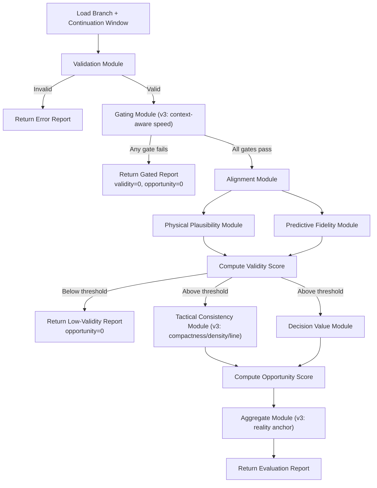

# Design Document: Evaluator v3 — Tactical Calibration

## Overview

This design describes the v3 calibration upgrade to the football play simulation evaluator. The v2 evaluator achieved 80% benchmark accuracy (12/15 branches correct). Error analysis identified three root causes for the three misclassified branches:

1. **Tactical consistency is too permissive** — The current module only checks role zones and pairwise distances, always scoring ~1.0. It lacks spatial awareness of formation compactness, defensive density, and line integrity. This inflates the opportunity score for branches that should score lower.
2. **Opportunity score lacks a reality anchor** — Neutral branches (B14, B15) that mirror reality receive opportunity scores well above 0.5 because the permissive tactical consistency score dominates the weighted average. A dampening mechanism is needed to pull scores toward 0.5 when a branch closely resembles the continuation window.
3. **Gating uses a single hard speed threshold** — Branch B13 (sack + fumble) involves a QB being driven backward at ~25 yd/s during a contact event. The v2 gating module rejects this as "supersonic" because it uses a single `MAX_HUMAN_SPRINT_SPEED = 12 yd/s` threshold with no awareness of contact context.

The v3 upgrade addresses each root cause with a targeted, minimal change:

- **Tactical Consistency v2**: Add `compactness_score`, `defensive_density_score`, and `line_integrity_score` sub-metrics to the existing module, incorporated into the aggregate `consistency_score`.
- **Reality Anchor**: Add a `branch_window_similarity` computation to the aggregate module that dampens opportunity scores toward 0.5 for branches mirroring reality.
- **Context-Aware Speed Thresholds**: Upgrade the gating module to apply elevated speed thresholds when contact events (sack, tackle) are present near the speed measurement.
- **Sub-Metric Expansion**: Extend the `SubMetrics` dataclass with the four new fields for full traceability.

All changes preserve the existing modular architecture, pipeline ordering (gating → validity → opportunity), JSON output structure, and module independence rule. No existing fields are renamed or removed.

## Architecture

### Pipeline Flow (v3)

The v3 pipeline is identical to v2 in structure. Changes are internal to three modules:



### Module Independence (unchanged)

Scoring modules under `src/scoring/` may import from `src/models/` and `src/utils/` only. They must never import from each other. All composition happens in `src/simulation_evaluator_v2.py` (renamed conceptually to v3 but file preserved for backward compatibility).

### Changed Modules Summary

| Module | File | Change |
|--------|------|--------|
| Tactical Consistency | `src/scoring/tactical_consistency.py` | Add 3 new sub-metrics, update aggregate formula |
| Gating | `src/scoring/gating.py` | Context-aware speed thresholds |
| Aggregate | `src/scoring/aggregate.py` | Reality anchor dampening |
| SubMetrics | `src/models/evaluation_report.py` | 4 new float fields |
| Constants | `src/utils/constants.py` | New threshold constants |
| Serialization | `src/utils/serialization.py` | Handle new SubMetrics fields |
| Orchestrator | `src/simulation_evaluator_v2.py` | Pass `continuation_window` to aggregate |

### Unchanged Modules

Validation, Alignment, Physical Plausibility, Predictive Fidelity, and Decision Value modules are not modified.

## Components and Interfaces

### 1. Tactical Consistency Module v2 — `src/scoring/tactical_consistency.py`

#### Updated Dataclass

```python
@dataclass
class TacticalConsistencyResult:
    consistency_score: float           # 0–1, weighted average of all 5 sub-metrics
    role_consistency_score: float      # 0–1 (existing)
    formation_coherence_score: float   # 0–1 (existing)
    compactness_score: float           # 0–1 (new)
    defensive_density_score: float     # 0–1 (new)
    line_integrity_score: float        # 0–1 (new)
```

#### New Sub-Metric Algorithms

**Compactness Score** — Measures how tight or spread the team formation is relative to the play context.

Algorithm:
1. Take the latest position snapshot (latest timestamp per player).
2. Compute the bounding box area of all player positions: `width = max_x - min_x`, `height = max_y - min_y`, `area = width * height`.
3. Normalize: `raw = area / MAX_FORMATION_AREA`. If `raw <= IDEAL_COMPACTNESS_RATIO`, score = 1.0. Otherwise, score = `1.0 - ((raw - IDEAL_COMPACTNESS_RATIO) / (1.0 - IDEAL_COMPACTNESS_RATIO))`, clamped to [0, 1].
4. A formation that is too spread (large bounding box) scores low. A tight formation scores high.

Constants:
- `MAX_FORMATION_AREA = FIELD_WIDTH * 40.0` — Maximum reasonable formation area (full width × 40 yards deep).
- `IDEAL_COMPACTNESS_RATIO = 0.3` — Formations using ≤30% of max area are considered ideally compact.

**Defensive Density Score** — Measures concentration of defensive players around key offensive players.

Algorithm:
1. Identify the ball carrier or QB from `player_roles` (prefer ball carrier if events indicate a handoff/catch; fall back to QB).
2. Take the latest position snapshot.
3. Identify defensive players (roles: DL, LB, CB, S).
4. For each defensive player, compute Euclidean distance to the key offensive player.
5. Count defenders within `DEFENSIVE_DENSITY_RADIUS` yards.
6. Score = `min(1.0, defenders_within_radius / EXPECTED_DEFENDERS_NEAR_BALL)`, clamped to [0, 1].
7. If no defensive players exist in the data, return 0.5 (neutral).

Constants:
- `DEFENSIVE_DENSITY_RADIUS = 10.0` — yards; radius around the key player to count defenders.
- `EXPECTED_DEFENDERS_NEAR_BALL = 3.0` — expected number of defenders near the ball for a "dense" defense.

**Line Integrity Score** — Measures whether OL and DL players maintain a coherent line shape.

Algorithm:
1. Take the latest position snapshot.
2. Separate OL players and DL players by role.
3. For each group (OL, DL), if ≥2 players exist:
   a. Sort by x-coordinate.
   b. Compute consecutive gaps: `gap_i = x_{i+1} - x_i`.
   c. Compute gap variance: `variance = sum((gap - mean_gap)^2) / n_gaps`.
   d. Score for this group = `1.0 - min(1.0, variance / MAX_LINE_GAP_VARIANCE)`.
4. If only one group has ≥2 players, use that group's score. If neither, return 1.0 (no line to violate).
5. Final score = average of OL and DL scores, clamped to [0, 1].

Constants:
- `MAX_LINE_GAP_VARIANCE = 25.0` — Maximum acceptable gap variance (yards²) before the line is considered broken.

#### Updated Aggregate Formula

The v2 `consistency_score` was `(role + formation) / 2`. The v3 formula uses a weighted average of all five sub-metrics:

```python
consistency_score = clamp(
    0.25 * role_consistency_score
    + 0.20 * formation_coherence_score
    + 0.20 * compactness_score
    + 0.20 * defensive_density_score
    + 0.15 * line_integrity_score
)
```

Rationale: Role consistency remains the most important signal. The three new spatial metrics share the remaining weight roughly equally, with line integrity slightly lower because it only applies when line players are present.

#### Updated Public API

```python
def score_tactical_consistency(
    aligned_branch: dict,
) -> TacticalConsistencyResult:
    """Score tactical consistency of player roles, formations, and spatial metrics.

    v3 additions: compactness_score, defensive_density_score, line_integrity_score.
    The aggregate consistency_score is a weighted average of all five sub-metrics.

    Args:
        aligned_branch: Aligned branch data. Expected keys:
            ``positions``, ``player_roles``, ``events`` (for ball carrier detection).

    Returns:
        TacticalConsistencyResult with aggregate and per-dimension scores.
    """
```

### 2. Gating Module v3 — `src/scoring/gating.py`

#### Context-Aware Speed Check

The existing `_check_max_speed` function is replaced with a context-aware version:

```python
def _check_max_speed(positions: list[dict], events: list[dict] | None = None) -> tuple[bool, list[str]]:
    """Check player speeds with context-aware thresholds.

    For each player speed measurement:
    1. Check if a contact event (sack, tackle, hit, block) exists within
       CONTACT_TIME_WINDOW seconds of the measurement midpoint.
    2. If contact context: apply CONTACT_SPEED_THRESHOLD.
    3. If no contact context: apply MAX_HUMAN_SPRINT_SPEED (base threshold).
    4. If speed exceeds the applicable threshold, fail with explanation
       including the applied threshold and context.
    """
```

Algorithm:
1. Group positions by player_id, sort by timestamp.
2. For each consecutive pair, compute speed = distance / dt.
3. Compute the measurement midpoint timestamp: `t_mid = (t1 + t2) / 2`.
4. Scan events for contact types: `{"sack", "tackle", "hit", "block", "fumble"}`.
5. If any contact event has `|event.timestamp - t_mid| <= CONTACT_TIME_WINDOW`, use `CONTACT_SPEED_THRESHOLD`.
6. Otherwise, use `MAX_HUMAN_SPRINT_SPEED`.
7. If speed > applicable threshold, add explanation with the threshold used and whether contact context was detected.

Constants:
- `CONTACT_SPEED_THRESHOLD = 25.0` — yards/second; elevated threshold during contact.
- `CONTACT_TIME_WINDOW = 0.5` — seconds; how close a contact event must be to the speed measurement.
- `CONTACT_EVENT_TYPES = {"sack", "tackle", "hit", "block", "fumble"}` — event types that indicate contact context.

#### Updated `run_gates` Signature

```python
def run_gates(branch: dict) -> GatingResult:
    """Execute all gating checks on a branch.

    v3 change: max_speed gate now accepts events for contact-context awareness.
    The branch dict's ``events`` key is passed to the speed check.
    """
```

The `run_gates` function extracts `events` from the branch dict and passes it to `_check_max_speed`. No signature change to `run_gates` itself — it still takes a branch dict.

### 3. Aggregate Module v3 — `src/scoring/aggregate.py`

#### Reality Anchor Mechanism

After computing the raw opportunity score, the aggregate module applies a reality anchor:

```python
def _compute_branch_window_similarity(
    aligned_branch: dict, aligned_window: dict
) -> float:
    """Compute similarity between branch trajectory and continuation window.

    Measures:
    1. Position similarity: average Euclidean distance between branch and
       window player positions at matching timestamps.
    2. Event similarity: fraction of branch events that have a matching
       event type in the window within a timing tolerance.
    3. Combined: weighted average (0.6 * position_sim + 0.4 * event_sim).

    Returns:
        Similarity score in [0, 1] where 1.0 = identical to reality.
    """
```

Algorithm for position similarity:
1. For each player in the branch, find the closest matching position in the window (by player_id and timestamp).
2. Compute Euclidean distance for each match.
3. Average distance, normalized: `pos_sim = 1.0 - clamp(avg_dist / SIMILARITY_MAX_DISTANCE)`.

Algorithm for event similarity:
1. For each branch event, check if the window has an event of the same type within `SIMILARITY_EVENT_TOLERANCE` seconds.
2. `event_sim = matched_events / total_branch_events` (or 1.0 if no events).

Combined: `similarity = 0.6 * pos_sim + 0.4 * event_sim`.

**Dampening formula:**

```python
if similarity >= REALITY_ANCHOR_SIMILARITY_THRESHOLD:
    anchor_strength = (similarity - REALITY_ANCHOR_SIMILARITY_THRESHOLD) / (1.0 - REALITY_ANCHOR_SIMILARITY_THRESHOLD)
    dampened = raw_opportunity + anchor_strength * (0.5 - raw_opportunity) * REALITY_ANCHOR_DAMPENING_FACTOR
    opportunity_score = clamp(dampened)
```

This pulls the opportunity score toward 0.5 proportionally to how similar the branch is to reality. The dampening factor controls how aggressively the anchor pulls.

**Guardrails (Requirements 2.4, 2.5):**
- If the raw opportunity score > 0.6 (branch clearly better), the anchor cannot pull it below 0.6.
- If the raw opportunity score < 0.4 (branch clearly worse), the anchor cannot push it above 0.4.

Constants:
- `REALITY_ANCHOR_SIMILARITY_THRESHOLD = 0.7` — Similarity above this triggers dampening.
- `REALITY_ANCHOR_DAMPENING_FACTOR = 0.8` — How aggressively to pull toward 0.5 (0 = no effect, 1 = full pull).
- `SIMILARITY_MAX_DISTANCE = 15.0` — yards; distance normalization ceiling for position similarity.
- `SIMILARITY_EVENT_TOLERANCE = 0.3` — seconds; timing tolerance for event matching.

#### Updated AggregateInput

```python
@dataclass
class AggregateInput:
    plausibility: PhysicalPlausibilityResult
    fidelity: PredictiveFidelityResult
    alignment: AlignmentResult
    tactical: TacticalConsistencyResult
    decision: DecisionValueResult
    gating: GatingResult
    continuation_window: dict  # NEW: needed for reality anchor computation
```

#### Updated `compute_aggregate`

```python
def compute_aggregate(inputs: AggregateInput) -> EvaluationReport:
    """Combine sub-scores into a final EvaluationReport.

    v3 changes:
    - Computes branch_window_similarity from aligned branch and continuation window.
    - Applies reality anchor dampening to opportunity score.
    - Populates new sub-metric fields (compactness, density, line integrity, similarity).
    """
```

### 4. SubMetrics Expansion — `src/models/evaluation_report.py`

```python
@dataclass
class SubMetrics:
    # --- Existing fields (unchanged) ---
    speed_score: float = 0.0
    acceleration_score: float = 0.0
    deceleration_score: float = 0.0
    position_accuracy: float = 0.0
    event_timing_accuracy: float = 0.0
    formation_consistency: float = 0.0
    role_consistency_score: float = 0.0
    formation_coherence_score: float = 0.0
    yard_gain_differential: float = 0.0
    turnover_risk_delta: float = 0.0
    scoring_probability_delta: float = 0.0
    alignment_residual: float = 0.0
    plausibility_score: float = 0.0
    fidelity_score: float = 0.0
    tactical_consistency_score: float = 0.0
    decision_value_score: float = 0.0
    # --- New v3 fields ---
    compactness_score: float = 0.0
    defensive_density_score: float = 0.0
    line_integrity_score: float = 0.0
    branch_window_similarity: float = 0.0
```

All new fields default to 0.0 so existing code that constructs `SubMetrics()` without the new fields continues to work.

### 5. Constants — `src/utils/constants.py`

New constants added for v3:

```python
# --- Tactical Consistency v2 (v3 upgrade) ---
MAX_FORMATION_AREA: float = FIELD_WIDTH * 40.0       # ~2133 sq yards
IDEAL_COMPACTNESS_RATIO: float = 0.3
DEFENSIVE_DENSITY_RADIUS: float = 10.0               # yards
EXPECTED_DEFENDERS_NEAR_BALL: float = 3.0
MAX_LINE_GAP_VARIANCE: float = 25.0                  # yards²

# --- Context-Aware Speed Thresholds ---
CONTACT_SPEED_THRESHOLD: float = 25.0                # yards/second
CONTACT_TIME_WINDOW: float = 0.5                     # seconds
CONTACT_EVENT_TYPES: frozenset[str] = frozenset({
    "sack", "tackle", "hit", "block", "fumble",
})

# --- Reality Anchor ---
REALITY_ANCHOR_SIMILARITY_THRESHOLD: float = 0.7
REALITY_ANCHOR_DAMPENING_FACTOR: float = 0.8
SIMILARITY_MAX_DISTANCE: float = 15.0                # yards
SIMILARITY_EVENT_TOLERANCE: float = 0.3              # seconds
```

### 6. Serialization — `src/utils/serialization.py`

The `dict_to_report` function must handle the new `SubMetrics` fields. Since `SubMetrics` uses `**sub_metrics_data` construction and all new fields have defaults, this works automatically — no code change needed as long as the dict contains the new keys. For backward compatibility with old dicts missing the new keys, `dict_to_report` should use `SubMetrics(**{k: v for k, v in sub_metrics_data.items() if k in SubMetrics.__dataclass_fields__})` or simply rely on defaults.

### 7. Orchestrator — `src/simulation_evaluator_v2.py`

The orchestrator must pass the `continuation_window` to the aggregate module:

```python
aggregate_input = AggregateInput(
    plausibility=plausibility_result,
    fidelity=fidelity_result,
    alignment=alignment_result,
    tactical=tactical_result,
    decision=decision_result,
    gating=gating_result,
    continuation_window=aligned_window,  # NEW
)
```

No other orchestrator changes. The pipeline ordering is preserved.

## Data Models

### Updated TacticalConsistencyResult

```python
@dataclass
class TacticalConsistencyResult:
    consistency_score: float           # weighted average of all 5 sub-metrics
    role_consistency_score: float      # existing
    formation_coherence_score: float   # existing
    compactness_score: float           # NEW: bounding box compactness
    defensive_density_score: float     # NEW: defenders near ball carrier
    line_integrity_score: float        # NEW: OL/DL gap variance
```

### Updated SubMetrics

See Section 4 above. Four new float fields appended, all defaulting to 0.0.

### Updated AggregateInput

See Section 3 above. One new field: `continuation_window: dict`.

### Constants

See Section 5 above. All new constants are typed floats or `frozenset[str]`.

### Unchanged Models

`Branch`, `ContinuationWindow`, `EvaluationReport`, `EvaluatorConfig`, `ValidationResult`, `GatingResult`, `AlignmentResult`, `PhysicalPlausibilityResult`, `PredictiveFidelityResult`, `DecisionValueResult` — all unchanged in structure. `GatingResult` is unchanged in its dataclass definition; only the internal logic of `_check_max_speed` changes.


## Correctness Properties

*A property is a characteristic or behavior that should hold true across all valid executions of a system — essentially, a formal statement about what the system should do. Properties serve as the bridge between human-readable specifications and machine-verifiable correctness guarantees.*

### Property 1: All v3 scores and sub-metrics are in [0, 1]

*For any* valid branch processed by the v3 Evaluator, every score field (validity_score, opportunity_score) and every sub-metric field in the EvaluationReport — including the new compactness_score, defensive_density_score, line_integrity_score, and branch_window_similarity — SHALL be a float in the range [0.0, 1.0].

**Validates: Requirements 1.1, 1.2, 1.3, 2.1, 4.5, 6.6**

### Property 2: Tactical consistency score equals weighted average of sub-metrics

*For any* valid aligned branch, the TacticalConsistencyResult's consistency_score SHALL equal the weighted average `0.25 * role_consistency_score + 0.20 * formation_coherence_score + 0.20 * compactness_score + 0.20 * defensive_density_score + 0.15 * line_integrity_score`, clamped to [0, 1].

**Validates: Requirements 1.4**

### Property 3: Reality anchor moves opportunity toward 0.5

*For any* aggregate input where branch_window_similarity exceeds the configured threshold, the dampened opportunity_score SHALL be between the raw (pre-anchor) opportunity_score and 0.5 (inclusive). That is, if raw > 0.5 then dampened ≤ raw, and if raw < 0.5 then dampened ≥ raw.

**Validates: Requirements 2.2**

### Property 4: Near-identical branches score opportunity in [0.4, 0.6]

*For any* branch whose positions and events are nearly identical to the continuation window (branch_window_similarity ≥ 0.95), the v3 Evaluator SHALL assign an opportunity_score within [0.4, 0.6].

**Validates: Requirements 2.3**

### Property 5: Reality anchor respects directional bounds

*For any* aggregate input, the reality anchor SHALL not suppress an opportunity_score that would otherwise be above 0.6 to below 0.6, and SHALL not inflate an opportunity_score that would otherwise be below 0.4 to above 0.4.

**Validates: Requirements 2.4, 2.5**

### Property 6: Contact context allows elevated speed threshold

*For any* branch where a player's speed between consecutive frames exceeds MAX_HUMAN_SPRINT_SPEED but is at or below CONTACT_SPEED_THRESHOLD, and a contact event (sack, tackle, hit, block, fumble) exists within CONTACT_TIME_WINDOW seconds of the speed measurement, the Gating Module SHALL pass the max_speed gate.

**Validates: Requirements 3.2, 3.3**

### Property 7: Speed exceeding contact threshold causes rejection

*For any* branch where a player's speed between consecutive frames exceeds CONTACT_SPEED_THRESHOLD, the Gating Module SHALL reject the branch with max_speed flag set to false, regardless of whether contact events are present.

**Validates: Requirements 3.4**

### Property 8: Speed rejection explanation includes threshold and context

*For any* branch rejected by the max_speed gate, the GatingResult explanations SHALL contain at least one string that mentions the numeric threshold value that was applied and whether contact context was detected.

**Validates: Requirements 3.6**

### Property 9: EvaluationReport round-trip serialization with v3 fields

*For any* valid EvaluationReport produced by the v3 Evaluator (including the new sub-metric fields), serializing to a dict via `report_to_dict`, converting to JSON via `json.dumps`, deserializing via `json.loads`, and reconstructing via `dict_to_report` SHALL produce an EvaluationReport equivalent to the original.

**Validates: Requirements 4.4, 6.7**

### Property 10: Gating failure zeroes downstream scores (v3 preserved)

*For any* branch that fails any gating check in the v3 Evaluator, the report SHALL have validity_score = 0.0 and opportunity_score = 0.0, with passed_gating = False.

**Validates: Requirements 6.5**

### Property 11: TacticalConsistencyResult round-trip serialization

*For any* valid TacticalConsistencyResult (including the new compactness_score, defensive_density_score, line_integrity_score fields), converting to dict via `dataclasses.asdict()` then reconstructing via `TacticalConsistencyResult(**d)` SHALL produce an equivalent instance.

**Validates: Requirements 7.1, 7.2, 7.3**

## Error Handling

### Tactical Consistency Errors

| Condition | Behavior |
|-----------|----------|
| No positions in aligned branch | Return all sub-metrics at 1.0 (nothing to violate), consistent with v2 behavior. |
| No player_roles provided | Role consistency = 1.0 (no roles to violate). Compactness and line integrity still computed from positions. Defensive density = 0.5 (neutral, no roles to identify defenders). |
| No defensive players in data | Defensive density score = 0.5 (neutral). |
| No OL/DL players in data | Line integrity score = 1.0 (no line to violate). |
| Single player in positions | Compactness = 1.0 (trivially compact). Formation coherence = 1.0. Line integrity = 1.0. |
| NaN/Inf in position coordinates | All sub-metric computations use `_clamp()` which replaces NaN/Inf with 0.0. |

### Gating Errors (v3 additions)

| Condition | Behavior |
|-----------|----------|
| No events in branch | Contact context is never detected. Base threshold (`MAX_HUMAN_SPRINT_SPEED`) is always used. Behavior identical to v2. |
| Events list is malformed | Events without `event_type` or `timestamp` keys are skipped during contact detection. Base threshold applies. |
| Contact event exactly at boundary of time window | Included (uses `<=` comparison). |
| Speed exactly at threshold | Passes (uses strict `>` for rejection). |

### Aggregate Errors (v3 additions)

| Condition | Behavior |
|-----------|----------|
| No continuation_window in AggregateInput | `branch_window_similarity` = 0.0 (no similarity data). Reality anchor has no effect. |
| Empty outcomes in continuation window | Position similarity = 0.5 (neutral). Event similarity = 1.0 (no events to mismatch). Combined similarity likely below threshold, so no dampening. |
| Similarity exactly at threshold | Dampening is triggered (uses `>=` comparison). |

### General Principles (unchanged from v2)

- No silent failures. Every error path produces a human-readable explanation.
- The orchestrator is the single error-handling boundary.
- Error-state reports are still valid JSON and conform to the EvaluationReport schema.
- All new sub-metric computations use `_clamp()` to guard against NaN/Inf.

## Testing Strategy

### Test Organization

New and updated test files for v3:

| Source | Test File | Type |
|--------|-----------|------|
| `src/scoring/tactical_consistency.py` | `tests/scoring/test_tactical_consistency.py` | Unit (update) |
| `src/scoring/tactical_consistency.py` | `tests/scoring/test_tactical_consistency_properties.py` | Property (update) |
| `src/scoring/gating.py` | `tests/scoring/test_gating.py` | Unit (update) |
| `src/scoring/gating.py` | `tests/scoring/test_gating_properties.py` | Property (update) |
| `src/scoring/aggregate.py` | `tests/scoring/test_aggregate.py` | Unit (update) |
| `src/models/evaluation_report.py` | `tests/models/test_models.py` | Unit (update) |
| `src/utils/serialization.py` | `tests/utils/test_serialization.py` | Unit (update) |
| `src/utils/serialization.py` | `tests/utils/test_serialization_properties.py` | Property (update) |
| `src/simulation_evaluator_v2.py` | `tests/test_evaluator_v2.py` | Unit (update) |
| `src/simulation_evaluator_v2.py` | `tests/test_evaluator_v2_properties.py` | Property (update) |
| Benchmark regression | `tests/test_benchmark_regression.py` | Regression (new) |

### Unit Tests (pytest)

New unit tests for v3 changes:

- **Tactical Consistency**:
  - Compactness: tight formation scores high; excessively spread formation scores low.
  - Defensive density: defenders clustered near QB scores high; no defenders near ball scores low.
  - Line integrity: evenly spaced OL scores high; large gaps in OL scores low.
  - Aggregate: weighted average matches expected formula.
  - Incoherent formation with valid roles scores below 0.7 (Req 1.5).
  - TacticalConsistencyResult has all new fields (Req 1.6).

- **Gating**:
  - Branch with sack event and speed 20 yd/s passes (contact context).
  - Branch with speed 20 yd/s and no contact events fails.
  - Branch with speed 26 yd/s and contact event fails (exceeds contact threshold).
  - Explanation mentions threshold value and contact context (Req 3.6).
  - Branch with no events behaves like v2 (base threshold only).

- **Aggregate**:
  - Branch identical to window gets similarity ~1.0 and opportunity in [0.4, 0.6].
  - Branch clearly better gets opportunity > 0.6 even with high similarity.
  - Branch clearly worse gets opportunity < 0.4 even with high similarity.
  - branch_window_similarity populated in sub_metrics (Req 2.6).

- **SubMetrics**: New fields exist with correct defaults.

- **Serialization**: Round-trip with new fields.

### Regression Tests (pytest, data-driven)

- **New file**: `tests/test_benchmark_regression.py`
- Load `data/benchmark_input.json` and `data/benchmark_annotated.json`.
- Run all 15 branches through the v3 evaluator.
- Verify each branch's validity_score and opportunity_score fall within annotated expected ranges.
- Specifically verify B13 passes gating and opportunity in [0.0, 0.3] (Req 5.1).
- Specifically verify B14 opportunity in [0.4, 0.6] (Req 5.2).
- Specifically verify B15 opportunity in [0.4, 0.6] (Req 5.3).
- Verify the 12 branches that passed in v2 continue to pass (Req 5.6).

### Property-Based Tests (hypothesis)

Property-based testing library: `hypothesis` (Python). Minimum 100 iterations per property test.

| Property | Test Description | Tag |
|----------|-----------------|-----|
| 1 | Generate valid branches → verify all scores and sub-metrics (including v3 fields) in [0, 1] | `Feature: evaluator-v3-tactical-calibration, Property 1: All v3 scores and sub-metrics are in [0, 1]` |
| 2 | Generate aligned branches → verify consistency_score matches weighted formula | `Feature: evaluator-v3-tactical-calibration, Property 2: Tactical consistency score equals weighted average of sub-metrics` |
| 3 | Generate aggregate inputs with high similarity → verify dampening moves toward 0.5 | `Feature: evaluator-v3-tactical-calibration, Property 3: Reality anchor moves opportunity toward 0.5` |
| 4 | Generate branches nearly identical to window → verify opportunity in [0.4, 0.6] | `Feature: evaluator-v3-tactical-calibration, Property 4: Near-identical branches score opportunity in [0.4, 0.6]` |
| 5 | Generate aggregate inputs with various raw opportunities and high similarity → verify directional bounds | `Feature: evaluator-v3-tactical-calibration, Property 5: Reality anchor respects directional bounds` |
| 6 | Generate branches with contact events and speeds between base and contact thresholds → verify gating passes | `Feature: evaluator-v3-tactical-calibration, Property 6: Contact context allows elevated speed threshold` |
| 7 | Generate branches with speeds exceeding contact threshold → verify gating rejects | `Feature: evaluator-v3-tactical-calibration, Property 7: Speed exceeding contact threshold causes rejection` |
| 8 | Generate branches rejected by speed gate → verify explanation content | `Feature: evaluator-v3-tactical-calibration, Property 8: Speed rejection explanation includes threshold and context` |
| 9 | Generate random EvaluationReports with v3 fields → verify round-trip serialization | `Feature: evaluator-v3-tactical-calibration, Property 9: EvaluationReport round-trip serialization with v3 fields` |
| 10 | Generate branches that fail gating → verify validity=0, opportunity=0 | `Feature: evaluator-v3-tactical-calibration, Property 10: Gating failure zeroes downstream scores` |
| 11 | Generate random TacticalConsistencyResult → verify dict round-trip | `Feature: evaluator-v3-tactical-calibration, Property 11: TacticalConsistencyResult round-trip serialization` |

### Hypothesis Strategy Updates

The existing strategies in `tests/strategies.py` need updates:

- **`sub_metrics_strategy()`**: Add the four new fields (compactness_score, defensive_density_score, line_integrity_score, branch_window_similarity) as unit floats.
- **`evaluation_report_strategy()`**: Uses updated `sub_metrics_strategy()` automatically.
- **New `tactical_consistency_result_strategy()`**: Generate random TacticalConsistencyResult instances with all 6 fields as unit floats.
- **New `contact_speed_branch_strategy()`**: Generate branches with contact events and player speeds between `MAX_HUMAN_SPRINT_SPEED` and `CONTACT_SPEED_THRESHOLD`.
- **New `near_identical_branch_window_strategy()`**: Generate branch/window pairs where the branch is a near-copy of the window with tiny perturbations.
- **Update `any_branch_strategy()`**: Include contact-speed branches in the mix.
