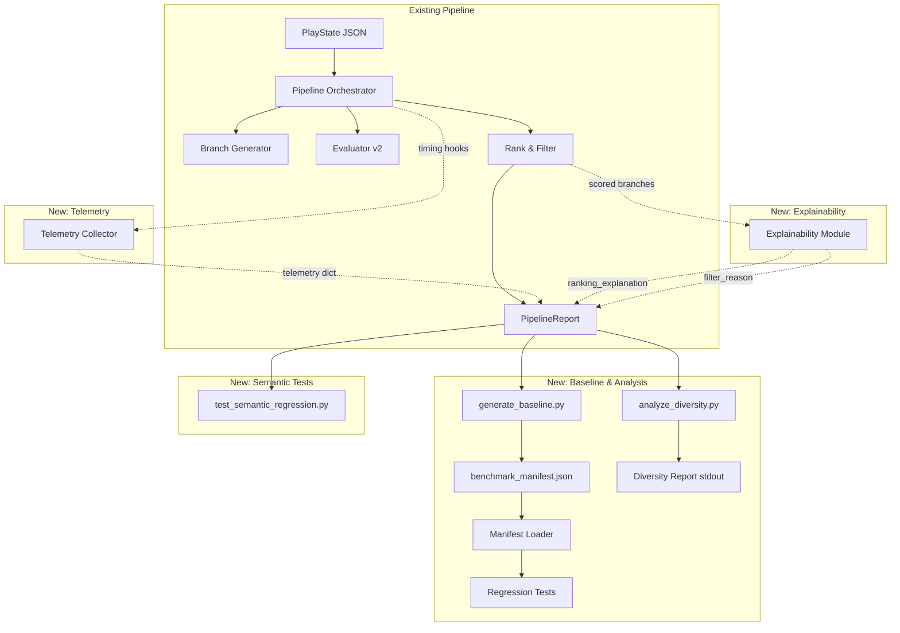
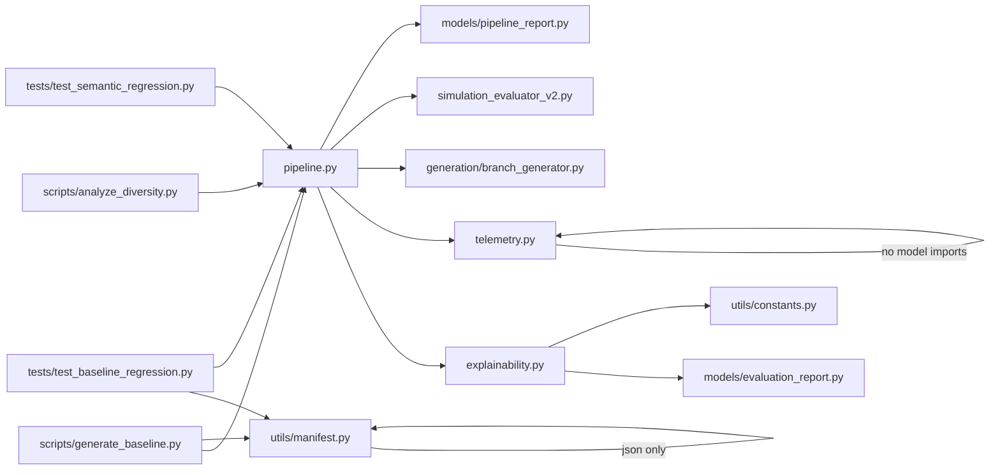

# Design Document: Pipeline Maturity Baseline

## Overview

This design describes the maturity layer for the branch generation pipeline — a set of baseline snapshots, semantic regression tests, diversity analysis, telemetry instrumentation, and branch-level explainability that transitions the pipeline from "build" mode to "prove utility and control drift" mode.

The pipeline is fully implemented (234 tests passing, 3 demo play states, end-to-end generation → evaluation → ranking). This feature freezes an official v1.0-baseline, adds semantic regression tests encoding tactical business behavior, measures generator diversity, instruments the pipeline with per-execution telemetry, and annotates every ranked branch with a human-readable explanation of its ranking.

Six new components are introduced:

1. **Benchmark Manifest** (`data/benchmark_manifest.json`) — Official v1.0-baseline expectations per scenario, generated by `scripts/generate_baseline.py`.
2. **Manifest Loader** (`src/utils/manifest.py`) — Parse/print/validate the benchmark manifest with round-trip fidelity.
3. **Explainability Module** (`src/explainability.py`) — Pure functions that produce ranking justifications and filter reasons from evaluation data.
4. **Telemetry Collector** (`src/telemetry.py`) — Lightweight timing and counting instrumentation wired into the pipeline orchestrator.
5. **Diversity Analyzer** (`scripts/analyze_diversity.py`) — Script computing entropy, strategy dominance, and discard rates across scenarios.
6. **Baseline Generator** (`scripts/generate_baseline.py`) — Script that runs the pipeline on all demo scenarios and writes the manifest.

Key design constraints:
- No new heavyweight dependencies. All computation uses the standard library + existing `dataclasses`.
- Scoring modules under `src/scoring/` remain independent — no cross-imports. All new composition happens in `src/pipeline.py` and `src/explainability.py`.
- All output is JSON-serializable.
- Functions are small and single-purpose (~40 lines max).
- Telemetry and explainability are additive — existing `PipelineReport` and `RankedBranch` schemas are extended via `metadata` dicts, not structural changes to the dataclasses.

## Architecture

### High-Level Integration



### Layer Separation

| Layer | Location | Responsibility |
|-------|----------|----------------|
| Manifest I/O | `src/utils/manifest.py` | Parse, validate, and print benchmark manifest JSON |
| Explainability | `src/explainability.py` | Pure functions: ranking justifications, filter reasons |
| Telemetry | `src/telemetry.py` | Timing and counting instrumentation for pipeline stages |
| Orchestration (modified) | `src/pipeline.py` | Wires telemetry + explainability into existing pipeline flow |
| Scripts | `scripts/generate_baseline.py`, `scripts/analyze_diversity.py` | Baseline generation and diversity analysis |
| Tests | `tests/test_semantic_regression.py`, `tests/test_baseline_regression.py` | Semantic and baseline regression tests |
| Data | `data/benchmark_manifest.json` | Frozen v1.0-baseline expectations |

### Module Dependency Graph



The explainability module imports from `src/models/` and `src/utils/constants.py` only — it does not import from `src/scoring/`. It receives evaluation data as dicts (already computed by the evaluator). The telemetry module is self-contained with no model imports. The manifest loader is a pure JSON utility.

## Components and Interfaces

### 1. Manifest Loader — `src/utils/manifest.py`

Pure functions for loading and saving the benchmark manifest. No class state.

```python
def load_manifest(path: str) -> dict:
    """Load and validate a benchmark manifest from a JSON file.

    Args:
        path: File path to benchmark_manifest.json.

    Returns:
        Validated manifest dict with keys: version, pipeline_config, scenarios.

    Raises:
        FileNotFoundError: If the file does not exist.
        json.JSONDecodeError: If the file contains invalid JSON.
        ValueError: If required keys are missing or malformed.
    """

def validate_manifest(data: dict) -> None:
    """Validate manifest structure.

    Checks for required top-level keys (version, pipeline_config, scenarios),
    required per-scenario keys (scenario_file, gating_pass_count,
    top_branch_min_score, bottom_branch_max_score, strategy_counts,
    expected_top_k), and required pipeline_config keys (n, k, seed,
    validity_weight, opportunity_weight).

    Args:
        data: Manifest dict to validate.

    Raises:
        ValueError: With descriptive message identifying the missing/invalid key.
    """

def manifest_to_dict(manifest: dict) -> dict:
    """Produce a JSON-serializable dict from a manifest.

    This is the identity function for well-formed manifests (they are
    already plain dicts), but serves as the explicit "print" half of
    the round-trip contract.

    Args:
        manifest: Validated manifest dict.

    Returns:
        JSON-serializable dict.
    """

def save_manifest(manifest: dict, path: str) -> None:
    """Write a manifest dict to a JSON file with 2-space indentation.

    Args:
        manifest: Validated manifest dict.
        path: Output file path.
    """
```

### 2. Explainability Module — `src/explainability.py`

Pure functions that produce human-readable explanations from evaluation data. No side effects, no scoring module imports.

```python
from src.utils.constants import DEFAULT_VALIDITY_THRESHOLD

# Sub-metric display names for explanation text
_SUB_METRIC_NAMES: dict[str, str] = {
    "speed_score": "Physical Speed",
    "acceleration_score": "Acceleration",
    "deceleration_score": "Deceleration",
    "position_accuracy": "Position Accuracy",
    "event_timing_accuracy": "Event Timing",
    "formation_consistency": "Formation Consistency",
    "role_consistency_score": "Role Consistency",
    "formation_coherence_score": "Formation Coherence",
    "yard_gain_differential": "Yard Gain Differential",
    "turnover_risk_delta": "Turnover Risk",
    "scoring_probability_delta": "Scoring Probability",
    "compactness_score": "Formation Compactness",
    "defensive_density_score": "Defensive Density",
    "line_integrity_score": "Line Integrity",
    "branch_window_similarity": "Reality Similarity",
}

# Validity-related sub-metric keys
_VALIDITY_METRICS: list[str] = [
    "speed_score", "acceleration_score", "deceleration_score",
    "position_accuracy", "event_timing_accuracy", "formation_consistency",
    "plausibility_score", "fidelity_score",
]

# Opportunity-related sub-metric keys
_OPPORTUNITY_METRICS: list[str] = [
    "role_consistency_score", "formation_coherence_score",
    "yard_gain_differential", "turnover_risk_delta",
    "scoring_probability_delta", "tactical_consistency_score",
    "decision_value_score", "compactness_score",
    "defensive_density_score", "line_integrity_score",
]

# Threshold for "promoted" vs "penalized" classification
_PROMOTION_THRESHOLD: float = 0.6
_PENALTY_THRESHOLD: float = 0.4


def build_ranking_explanation(
    evaluation_report: dict,
    validity_threshold: float = DEFAULT_VALIDITY_THRESHOLD,
) -> dict:
    """Build a ranking explanation for a top-K branch.

    Analyzes sub_metrics to identify promoted and penalized factors,
    determines the top and bottom scoring blocks, and flags near-threshold
    branches.

    Args:
        evaluation_report: Full evaluation report dict (from EvaluationReport).
        validity_threshold: The validity threshold used for filtering.

    Returns:
        Dict with keys: promoted_factors (list[str]),
        penalized_factors (list[str]), top_scoring_block (str),
        bottom_scoring_block (str), and optionally near_threshold_warning (str).
    """

def build_filter_reason(
    evaluation_report: dict,
    passed_gating: bool,
    validity_threshold: float = DEFAULT_VALIDITY_THRESHOLD,
) -> str:
    """Build a filter reason for a rejected branch.

    Args:
        evaluation_report: Full evaluation report dict.
        passed_gating: Whether the branch passed gating.
        validity_threshold: The validity threshold used for filtering.

    Returns:
        String starting with "Rejected: " (gating failure) or
        "Filtered: " (below validity threshold).
    """
```

#### Explanation Logic

**Ranking Explanation (`build_ranking_explanation`)**:
1. Extract `sub_metrics` dict from the evaluation report.
2. For each sub-metric in `_VALIDITY_METRICS` + `_OPPORTUNITY_METRICS`:
   - If value ≥ `_PROMOTION_THRESHOLD` → add display name to `promoted_factors`.
   - If value ≤ `_PENALTY_THRESHOLD` → add display name to `penalized_factors`.
3. Find the sub-metric with the highest value → `top_scoring_block`.
4. Find the sub-metric with the lowest value → `bottom_scoring_block`.
5. If `validity_score` is within 0.1 of `validity_threshold` → add `near_threshold_warning`.
6. If `validity_score > 0.7` → ensure the highest plausibility/fidelity sub-metric is in `promoted_factors` (Req 8.3).
7. If `opportunity_score < 0.4` → ensure the lowest tactical/decision sub-metric is in `penalized_factors` (Req 8.4).

**Filter Reason (`build_filter_reason`)**:
1. If `passed_gating` is False → return `"Rejected: "` + first gating explanation from the report.
2. If `passed_gating` is True but validity below threshold → return `"Filtered: "` + description of which validity sub-scores were insufficient (sub-metrics below 0.3).

### 3. Telemetry Collector — `src/telemetry.py`

Lightweight instrumentation. No external dependencies.

```python
import time
from dataclasses import dataclass, field


@dataclass
class TelemetryCollector:
    """Collects per-execution pipeline telemetry.

    Attributes:
        branches_generated: Total branches produced by the generator.
        hard_fail_count: Branches that failed gating.
        score_filtered_count: Branches that passed gating but fell below validity threshold.
        avg_score_by_strategy: Average composite score per perturbation strategy.
        scenario_id: Identifier for the scenario (from play state metadata).
        stage_timings: Wall-clock seconds per pipeline stage.
    """
    branches_generated: int = 0
    hard_fail_count: int = 0
    score_filtered_count: int = 0
    avg_score_by_strategy: dict[str, float] = field(default_factory=dict)
    scenario_id: str = ""
    _stage_starts: dict[str, float] = field(default_factory=dict)
    stage_timings: dict[str, float] = field(default_factory=dict)

    def start_stage(self, stage_name: str) -> None:
        """Record the start time of a pipeline stage."""

    def end_stage(self, stage_name: str) -> None:
        """Record the end time and compute elapsed seconds for a stage."""

    def record_branch_result(
        self, strategy: str, composite_score: float,
        passed_gating: bool, passed_validity: bool,
    ) -> None:
        """Record the outcome of evaluating a single branch."""

    def to_dict(self) -> dict:
        """Produce the telemetry dict for inclusion in PipelineReport metadata.

        Returns:
            Dict with keys: branches_generated, hard_fail_count,
            score_filtered_count, avg_score_by_strategy,
            avg_score_by_scenario, time_per_stage.
        """
```

The `to_dict()` output conforms to Requirement 7.1:
```json
{
  "branches_generated": 20,
  "hard_fail_count": 3,
  "score_filtered_count": 2,
  "avg_score_by_strategy": {
    "route_variation": 0.45,
    "speed_variation": 0.52,
    "decision_variation": 0.38
  },
  "avg_score_by_scenario": "third_and_short_goal_line",
  "time_per_stage": {
    "generation": 0.12,
    "evaluation": 1.85,
    "ranking": 0.01
  }
}
```

### 4. Pipeline Orchestrator Modifications — `src/pipeline.py`

The existing `run_pipeline` function is modified to:

1. **Instantiate a `TelemetryCollector`** at the start of execution.
2. **Wrap each stage** (generation, evaluation, ranking) with `start_stage`/`end_stage` calls.
3. **Record each branch result** via `record_branch_result` after evaluation.
4. **Call `build_ranking_explanation`** for each branch in the top-K ranked list and attach the result as `ranking_explanation` in the `RankedBranch` dict within `ranked_branches`.
5. **Call `build_filter_reason`** for each branch not in the top-K and attach the result as `filter_reason` in the corresponding `evaluated_branches` entry.
6. **Include `telemetry.to_dict()`** in the `PipelineReport.metadata` under the key `"telemetry"`.

These changes are additive — the existing `PipelineReport` dataclass is unchanged. Telemetry goes into `metadata["telemetry"]`, explanations go into the existing dict structures within `ranked_branches` and `evaluated_branches`.

```python
# In run_pipeline, after ranking:
for rb in ranked:
    explanation = build_ranking_explanation(
        rb.evaluation_report, cfg.validity_weight  # validity_threshold
    )
    rb.evaluation_report["ranking_explanation"] = explanation

for eb in evaluated_branches:
    report_dict = eb["evaluation_report"]
    branch_id = report_dict.get("branch_id", "")
    in_top_k = any(r.branch_id == branch_id for r in ranked)
    if not in_top_k:
        reason = build_filter_reason(
            report_dict,
            report_dict.get("passed_gating", False),
        )
        eb["filter_reason"] = reason
```

### 5. Baseline Generation Script — `scripts/generate_baseline.py`

```python
"""Generate the benchmark manifest from current pipeline output.

Runs the pipeline on all 3 demo scenarios with default configuration
(N=20, K=5, seed=42) and writes data/benchmark_manifest.json.

Usage:
    python scripts/generate_baseline.py

Exit codes:
    0: Success
    1: Any scenario failed to produce a valid PipelineReport
"""

def generate_scenario_entry(
    scenario_file: str, report: PipelineReport
) -> dict:
    """Extract baseline expectations from a PipelineReport.

    Returns dict with: scenario_file, gating_pass_count,
    top_branch_min_score, bottom_branch_max_score,
    strategy_counts, expected_top_k.
    """

def main() -> None:
    """Run pipeline on all demo scenarios and write manifest."""
```

### 6. Diversity Analysis Script — `scripts/analyze_diversity.py`

```python
"""Analyze generator diversity across demo scenarios.

Runs the pipeline on all 3 demo scenarios and produces a human-readable
report covering strategy distribution, entropy, dominance, and discard rates.

Usage:
    python scripts/analyze_diversity.py

Exit codes:
    0: Success
    1: Any scenario failed to produce a valid PipelineReport
"""
import math

def compute_entropy(counts: dict[str, int]) -> float:
    """Compute Shannon entropy over a distribution of counts.

    Args:
        counts: Mapping of category to count.

    Returns:
        Entropy in bits. Higher = more uniform distribution.
    """

def compute_strategy_dominance(counts: dict[str, int]) -> float:
    """Compute the percentage of the most dominant strategy.

    Args:
        counts: Mapping of strategy to count in top-K.

    Returns:
        Dominance percentage (0–100).
    """

def analyze_scenario(
    scenario_file: str, report: PipelineReport
) -> dict:
    """Compute diversity metrics for a single scenario.

    Returns dict with: unique_passing_count, strategy_distribution,
    discard_rate, entropy, strategy_dominance, avg_score_by_strategy.
    """

def print_report(analyses: list[dict]) -> None:
    """Print the consolidated diversity report to stdout."""

def main() -> None:
    """Run pipeline on all demo scenarios and print diversity report."""
```

## Data Models

### Benchmark Manifest Schema — `data/benchmark_manifest.json`

```json
{
  "version": "v1.0-baseline",
  "pipeline_config": {
    "n": 20,
    "k": 5,
    "seed": 42,
    "validity_weight": 0.5,
    "opportunity_weight": 0.5
  },
  "scenarios": [
    {
      "scenario_file": "third_and_short_goal_line.json",
      "gating_pass_count": 14,
      "top_branch_min_score": 0.55,
      "bottom_branch_max_score": 0.35,
      "strategy_counts": {
        "route_variation": 7,
        "speed_variation": 7,
        "decision_variation": 6
      },
      "expected_top_k": [
        {"branch_id": "gen-001", "composite_score": 0.62},
        {"branch_id": "gen-004", "composite_score": 0.58}
      ]
    }
  ]
}
```

Note: The actual values above are illustrative. The real baseline is generated by `scripts/generate_baseline.py`.

### Telemetry Schema (embedded in `PipelineReport.metadata["telemetry"]`)

```json
{
  "branches_generated": 20,
  "hard_fail_count": 3,
  "score_filtered_count": 2,
  "avg_score_by_strategy": {
    "route_variation": 0.45,
    "speed_variation": 0.52,
    "decision_variation": 0.38
  },
  "avg_score_by_scenario": "third_and_short_goal_line",
  "time_per_stage": {
    "generation": 0.12,
    "evaluation": 1.85,
    "ranking": 0.01
  }
}
```

Invariant (Req 7.3): `hard_fail_count + score_filtered_count + len(ranked_branches) + (gating_pass_count - len(ranked_branches)) == branches_generated`. Simplified: `hard_fail_count + score_filtered_count + gating_pass_count_that_passed_validity == branches_generated` where the ranked branches are a subset of those that passed both gating and validity.

### Ranking Explanation Schema (embedded in `ranked_branches[].evaluation_report["ranking_explanation"]`)

```json
{
  "promoted_factors": ["Physical Speed", "Position Accuracy", "Formation Compactness"],
  "penalized_factors": ["Turnover Risk"],
  "top_scoring_block": "speed_score",
  "bottom_scoring_block": "turnover_risk_delta",
  "near_threshold_warning": "Validity score 0.40 is within 0.1 of threshold 0.35"
}
```

The `near_threshold_warning` key is present only when the branch's validity_score is within 0.1 of the validity threshold.

### Filter Reason Schema (embedded in `evaluated_branches[].filter_reason`)

For gating failures:
```
"Rejected: Player QB1 at t=1.5 has speed=15.2 yd/s exceeding threshold 12.0 yd/s (no contact context)"
```

For validity-filtered branches:
```
"Filtered: Validity score 0.28 below threshold 0.35. Low sub-scores: Position Accuracy (0.15), Event Timing (0.22)"
```

### Diversity Report Schema (stdout from `scripts/analyze_diversity.py`)

The report is printed as formatted text tables, not JSON. Structure per scenario:

```
=== Scenario: third_and_short_goal_line ===

Top-K Branches:
  Branch ID    Score   Strategy              Validity
  gen-001      0.62    route_variation        0.78
  gen-004      0.58    speed_variation        0.71
  ...

Strategy Distribution:
  Strategy            Count   Avg Score
  route_variation     7       0.45
  speed_variation     7       0.52
  decision_variation  6       0.38

Metrics:
  Discard Rate: 30.0%
  Top-K Entropy: 1.58 bits
  Strategy Dominance: 40.0% (speed_variation)

=== Cross-Scenario Summary ===
  Overall Discard Rate: 28.3%
  Dominance Warnings: None
```

### Existing Models — Extensions (no structural changes)

The following existing dataclasses are NOT modified. All new data is injected into their existing dict fields:

- **`PipelineReport.metadata`** — gains a `"telemetry"` key containing the telemetry dict.
- **`RankedBranch.evaluation_report`** — gains a `"ranking_explanation"` key containing the explanation dict.
- **`PipelineReport.evaluated_branches[]`** — entries gain a `"filter_reason"` key (string) when the branch was not in top-K.

This approach avoids schema changes to the dataclasses while keeping all output JSON-serializable.


## Correctness Properties

*A property is a characteristic or behavior that should hold true across all valid executions of a system — essentially, a formal statement about what the system should do. Properties serve as the bridge between human-readable specifications and machine-verifiable correctness guarantees.*

### Property 1: Benchmark manifest round-trip serialization

*For any* valid benchmark manifest dict (containing `version`, `pipeline_config` with all required keys, and `scenarios` with well-formed entries), writing it to a file via `save_manifest` and reading it back via `load_manifest` SHALL produce a dict equivalent to the original.

**Validates: Requirements 13.1, 13.3, 13.4**

### Property 2: Invalid manifest raises descriptive error

*For any* dict that is missing one or more of the required top-level keys (`version`, `pipeline_config`, `scenarios`) or has malformed scenario entries, calling `validate_manifest` SHALL raise a `ValueError` whose message identifies the missing or invalid key.

**Validates: Requirements 13.2**

### Property 3: Telemetry completeness

*For any* valid PlayState, running the pipeline SHALL produce a `PipelineReport` whose `metadata["telemetry"]` dict contains all required keys (`branches_generated`, `hard_fail_count`, `score_filtered_count`, `avg_score_by_strategy`, `avg_score_by_scenario`, `time_per_stage`), where `time_per_stage` contains at minimum `generation`, `evaluation`, and `ranking`, and the entire telemetry dict is JSON-serializable.

**Validates: Requirements 7.1, 7.2, 7.4**

### Property 4: Branch accounting invariant

*For any* pipeline execution, the telemetry values SHALL satisfy the conservation invariant: `hard_fail_count + score_filtered_count + gating_pass_count` (from metadata) equals `branches_generated`, where `gating_pass_count` is the number of branches that passed gating (regardless of whether they made it into top-K).

**Validates: Requirements 7.3**

### Property 5: Top-K branch quality invariant

*For any* pipeline execution that produces ranked branches, every branch in the `ranked_branches` list SHALL have `passed_gating` set to True and `validity_score` at or above the configured validity threshold in its evaluation report.

**Validates: Requirements 5.1, 5.2**

### Property 6: Gating failure explanations are non-empty

*For any* branch that fails gating (has `passed_gating` set to False in its evaluation report), the `explanations` list in that report SHALL contain at least one non-empty string describing the failure reason.

**Validates: Requirements 5.3**

### Property 7: Ranking explanation structure

*For any* pipeline execution that produces ranked branches, every branch in `ranked_branches` SHALL have a `ranking_explanation` dict in its evaluation report containing the keys `promoted_factors` (list of strings), `penalized_factors` (list of strings), `top_scoring_block` (string), and `bottom_scoring_block` (string).

**Validates: Requirements 8.1, 8.2**

### Property 8: High-validity branches reference plausibility/fidelity in promoted factors

*For any* evaluation report with `validity_score` above 0.7, the `ranking_explanation.promoted_factors` list SHALL include a reference to at least one plausibility or fidelity sub-metric (from the set: Physical Speed, Acceleration, Deceleration, Position Accuracy, Event Timing, Formation Consistency).

**Validates: Requirements 8.3**

### Property 9: Low-opportunity branches reference tactical/decision in penalized factors

*For any* evaluation report with `opportunity_score` below 0.4, the `ranking_explanation.penalized_factors` list SHALL include a reference to at least one tactical or decision sub-metric (from the set: Role Consistency, Formation Coherence, Yard Gain Differential, Turnover Risk, Scoring Probability, Formation Compactness, Defensive Density, Line Integrity).

**Validates: Requirements 8.4**

### Property 10: Near-threshold branches receive warning

*For any* evaluation report where `validity_score` is within 0.1 of the configured validity threshold, the `ranking_explanation` SHALL contain a `near_threshold_warning` string that is non-empty.

**Validates: Requirements 8.5**

### Property 11: Filter reason prefix correctness

*For any* branch not in the top-K ranked list: if the branch failed gating, its `filter_reason` SHALL start with `"Rejected: "`; if the branch passed gating but fell below the validity threshold, its `filter_reason` SHALL start with `"Filtered: "`.

**Validates: Requirements 9.1, 9.2**

### Property 12: Filter reason exclusivity

*For any* pipeline execution, the `filter_reason` field SHALL be present only on `evaluated_branches` entries whose `branch_id` does not appear in the `ranked_branches` list. Branches in the top-K SHALL NOT have a `filter_reason` field.

**Validates: Requirements 9.3**

### Property 13: Entropy and strategy dominance computation

*For any* non-empty distribution of strategy counts, `compute_entropy` SHALL return a non-negative value, and `compute_strategy_dominance` SHALL return a value in [0, 100]. When a single strategy accounts for more than 80% of the total count, `compute_strategy_dominance` SHALL return a value above 80.

**Validates: Requirements 6.2**

## Error Handling

### Manifest Loader Errors

| Condition | Behavior |
|-----------|----------|
| File does not exist | `load_manifest` raises `FileNotFoundError` with the file path. |
| File contains invalid JSON | `load_manifest` raises `json.JSONDecodeError` with parse details. |
| Manifest missing `version` key | `validate_manifest` raises `ValueError("Missing required key: version")`. |
| Manifest missing `pipeline_config` key | `validate_manifest` raises `ValueError("Missing required key: pipeline_config")`. |
| Manifest missing `scenarios` key | `validate_manifest` raises `ValueError("Missing required key: scenarios")`. |
| Scenario entry missing required keys | `validate_manifest` raises `ValueError` identifying the scenario and missing key. |
| `pipeline_config` missing required keys | `validate_manifest` raises `ValueError` identifying the missing config key. |

### Explainability Errors

| Condition | Behavior |
|-----------|----------|
| Evaluation report missing `sub_metrics` | `build_ranking_explanation` returns explanation with empty `promoted_factors` and `penalized_factors`, and `"unknown"` for top/bottom scoring blocks. |
| Evaluation report missing `explanations` | `build_filter_reason` returns generic reason string (e.g., `"Rejected: gating failure (no details available)"`). |
| All sub-metric values are equal | `top_scoring_block` and `bottom_scoring_block` are both set to the first sub-metric alphabetically. |

### Telemetry Errors

| Condition | Behavior |
|-----------|----------|
| `end_stage` called without matching `start_stage` | Stage timing is recorded as 0.0 seconds. |
| No branches evaluated (generator failure) | Telemetry records `branches_generated=0`, empty `avg_score_by_strategy`. |
| Division by zero in average computation | Returns 0.0 for the affected strategy's average. |

### Script Errors

| Condition | Behavior |
|-----------|----------|
| Demo play state file missing | Script prints error to stderr, exits with code 1. |
| Pipeline returns error report for a scenario | Script prints warning, exits with code 1. |
| Output file not writable (`generate_baseline.py`) | Script prints error to stderr, exits with code 1. |

### General Principles

- Explainability functions are pure and never raise exceptions — they degrade gracefully to generic messages.
- Telemetry collection never interferes with pipeline execution — timing failures are silently recorded as 0.0.
- Scripts use sys.exit(1) for any failure, with descriptive stderr messages.
- All error-state outputs remain JSON-serializable.

## Testing Strategy

### Test Organization

| Source | Test File | Type |
|--------|-----------|------|
| `src/utils/manifest.py` | `tests/utils/test_manifest.py` | Unit |
| `src/utils/manifest.py` | `tests/utils/test_manifest_properties.py` | Property |
| `src/explainability.py` | `tests/test_explainability.py` | Unit |
| `src/explainability.py` | `tests/test_explainability_properties.py` | Property |
| `src/telemetry.py` | `tests/test_telemetry.py` | Unit |
| `src/telemetry.py` | `tests/test_telemetry_properties.py` | Property |
| `src/pipeline.py` (telemetry + explainability) | `tests/test_pipeline_integration.py` | Integration |
| Semantic regression | `tests/test_semantic_regression.py` | Semantic regression |
| Baseline regression | `tests/test_baseline_regression.py` | Baseline regression |
| `scripts/analyze_diversity.py` | `tests/test_analyze_diversity.py` | Unit (for pure functions) |

### Dual Testing Approach

- **Unit tests**: Verify specific examples, edge cases, and error conditions for each new module.
- **Property tests**: Verify universal properties across all inputs using `hypothesis` with minimum 100 iterations per property.
- **Semantic regression tests**: Verify tactical business behavior of the pipeline on the 3 demo scenarios.
- **Baseline regression tests**: Verify pipeline output stability against the frozen benchmark manifest.

### Unit Tests (pytest)

- **Manifest Loader**: `load_manifest` on valid file returns dict with required keys; `validate_manifest` raises on missing keys; `save_manifest` writes valid JSON; round-trip produces equivalent dict; `load_manifest` raises `FileNotFoundError` on missing file; `load_manifest` raises `JSONDecodeError` on invalid JSON.
- **Explainability**: `build_ranking_explanation` produces all required keys; promoted_factors populated when sub-metrics are high; penalized_factors populated when sub-metrics are low; `near_threshold_warning` present when validity near threshold; `build_filter_reason` returns "Rejected: " prefix for gating failures; returns "Filtered: " prefix for validity failures; handles missing sub_metrics gracefully.
- **Telemetry**: `TelemetryCollector` records stage timings; `record_branch_result` updates counts and averages; `to_dict` produces JSON-serializable output with all required keys; branch accounting invariant holds after recording all branches.
- **Pipeline Integration**: Pipeline with telemetry produces metadata with telemetry key; ranked branches have ranking_explanation; filtered branches have filter_reason; filter_reason absent on top-K branches.
- **Diversity Analysis**: `compute_entropy` returns 0 for single-category distribution; returns max entropy for uniform distribution; `compute_strategy_dominance` returns 100 for single-strategy; returns correct percentage for mixed distributions.

### Property-Based Tests (hypothesis)

Property-based testing library: `hypothesis` (Python). Minimum 100 iterations per property test.

| Property | Test File | Tag |
|----------|-----------|-----|
| Property 1: Manifest round-trip | `tests/utils/test_manifest_properties.py` | Feature: pipeline-maturity-baseline, Property 1: Manifest round-trip serialization |
| Property 2: Invalid manifest error | `tests/utils/test_manifest_properties.py` | Feature: pipeline-maturity-baseline, Property 2: Invalid manifest raises descriptive error |
| Property 3: Telemetry completeness | `tests/test_telemetry_properties.py` | Feature: pipeline-maturity-baseline, Property 3: Telemetry completeness |
| Property 4: Branch accounting invariant | `tests/test_telemetry_properties.py` | Feature: pipeline-maturity-baseline, Property 4: Branch accounting invariant |
| Property 5: Top-K quality invariant | `tests/test_pipeline_integration.py` | Feature: pipeline-maturity-baseline, Property 5: Top-K branch quality invariant |
| Property 6: Gating failure explanations | `tests/test_explainability_properties.py` | Feature: pipeline-maturity-baseline, Property 6: Gating failure explanations non-empty |
| Property 7: Ranking explanation structure | `tests/test_explainability_properties.py` | Feature: pipeline-maturity-baseline, Property 7: Ranking explanation structure |
| Property 8: High-validity promoted factors | `tests/test_explainability_properties.py` | Feature: pipeline-maturity-baseline, Property 8: High-validity promoted factors |
| Property 9: Low-opportunity penalized factors | `tests/test_explainability_properties.py` | Feature: pipeline-maturity-baseline, Property 9: Low-opportunity penalized factors |
| Property 10: Near-threshold warning | `tests/test_explainability_properties.py` | Feature: pipeline-maturity-baseline, Property 10: Near-threshold warning |
| Property 11: Filter reason prefix | `tests/test_explainability_properties.py` | Feature: pipeline-maturity-baseline, Property 11: Filter reason prefix correctness |
| Property 12: Filter reason exclusivity | `tests/test_pipeline_integration.py` | Feature: pipeline-maturity-baseline, Property 12: Filter reason exclusivity |
| Property 13: Entropy and dominance | `tests/test_analyze_diversity.py` | Feature: pipeline-maturity-baseline, Property 13: Entropy and strategy dominance |

### Semantic Regression Tests — `tests/test_semantic_regression.py`

Uses `pytest` fixtures to run the pipeline once per scenario and reuse the `PipelineReport`:

```python
@pytest.fixture(scope="module")
def goal_line_report() -> PipelineReport:
    """Run pipeline on third_and_short_goal_line once for all goal-line tests."""

@pytest.fixture(scope="module")
def sack_recovery_report() -> PipelineReport:
    """Run pipeline on second_and_long_after_sack once for all sack tests."""

@pytest.fixture(scope="module")
def all_scenario_reports() -> dict[str, PipelineReport]:
    """Run pipeline on all 3 scenarios for cross-scenario tests."""
```

Test names encode tactical intentions:
- `test_goal_line_no_long_routes_in_top_k`
- `test_goal_line_has_decision_variation_in_top_k`
- `test_goal_line_average_score_above_threshold`
- `test_sack_recovery_has_route_variation_in_top_k`
- `test_sack_recovery_no_stagnant_branches_in_top_k`
- `test_sack_recovery_average_score_above_threshold`
- `test_all_scenarios_top_k_passed_gating`
- `test_all_scenarios_top_k_validity_above_minimum`
- `test_all_scenarios_gating_failures_have_explanations`

### Baseline Regression Tests — `tests/test_baseline_regression.py`

Loads the benchmark manifest and compares current pipeline output:

```python
@pytest.fixture(scope="module")
def manifest() -> dict:
    """Load the benchmark manifest."""

@pytest.fixture(scope="module")
def scenario_reports(manifest) -> dict[str, PipelineReport]:
    """Run pipeline on each manifest scenario with the manifest's config."""
```

Test names:
- `test_gating_pass_count_within_tolerance` (parametrized by scenario)
- `test_top_branch_score_within_tolerance` (parametrized by scenario)
- `test_top_k_branch_ids_match_baseline` (parametrized by scenario)

### Hypothesis Strategies for New Models

New strategies to add to `tests/strategies.py`:

```python
def manifest_strategy() -> st.SearchStrategy[dict]:
    """Generate valid benchmark manifest dicts."""

def evaluation_report_dict_strategy() -> st.SearchStrategy[dict]:
    """Generate evaluation report dicts (as produced by dataclasses.asdict)."""

def telemetry_collector_strategy() -> st.SearchStrategy[TelemetryCollector]:
    """Generate TelemetryCollector instances with recorded branch results."""

def strategy_counts_strategy() -> st.SearchStrategy[dict[str, int]]:
    """Generate strategy count distributions for entropy/dominance tests."""
```
