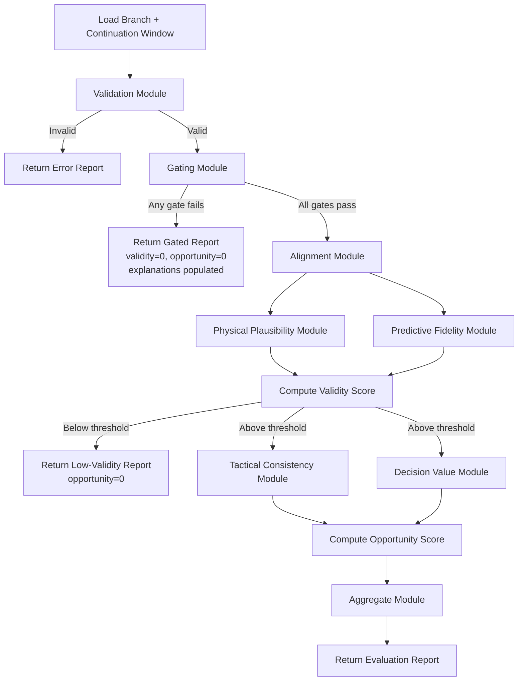
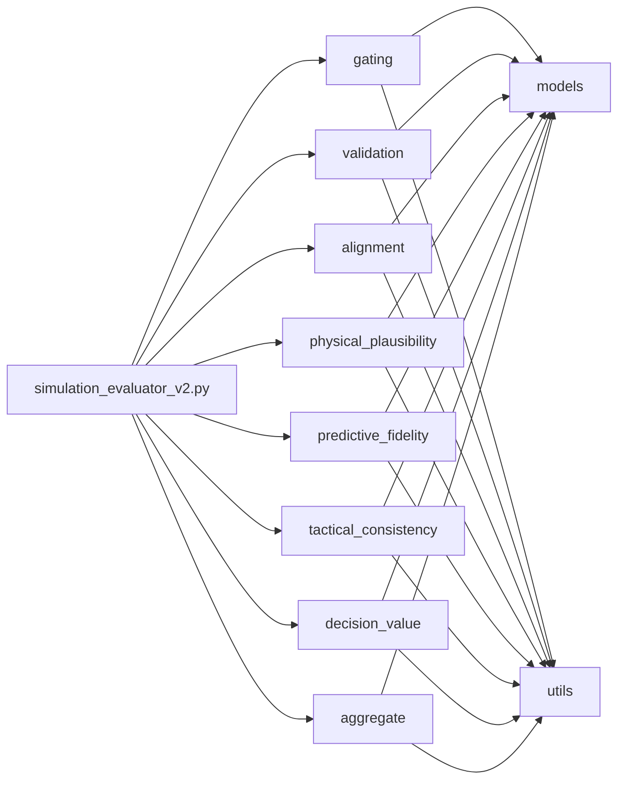

# Design Document: Simulation Evaluator v2

## Overview

This design describes the modular refactor of the football play simulation evaluator into `simulation_evaluator_v2`. The evaluator compares simulated play branches against real continuation windows and produces an `Evaluation_Report` containing a validity score, an opportunity score, gating flags, and human-readable explanations.

The refactor decomposes the monolithic evaluator into eight independent scoring modules under `src/scoring/`, composed exclusively at the orchestration layer in `src/simulation_evaluator_v2.py`. The pipeline enforces strict ordering — gating → validity → opportunity — with early termination on failure. All scoring is deterministic and rule-based with no ML dependencies.

Key design goals:
- Module independence: no scoring module imports from another scoring module.
- Transparency: every aggregate score is accompanied by traceable sub-metrics.
- Stability: the existing JSON output structure is preserved; new fields may be added but none renamed or removed.
- Testability: pure functions with explicit inputs/outputs, amenable to both example-based and property-based testing.

## Architecture

### Pipeline Flow



### Layer Separation

| Layer | Location | Responsibility |
|-------|----------|----------------|
| Orchestration | `src/simulation_evaluator_v2.py` | Pipeline sequencing, module composition, early termination |
| Scoring | `src/scoring/*.py` | Independent scoring computations (one module per file) |
| Models | `src/models/*.py` | Dataclass definitions for Branch, ContinuationWindow, EvaluationReport, sub-metrics |
| Utils | `src/utils/*.py` | Named constants (thresholds, field dimensions), shared pure helpers |
| Tests | `tests/` | Mirrors `src/` layout; unit, regression, and property-based tests |
| Data | `data/` | Demo inputs and fixture files |

### Module Independence Rule

Scoring modules under `src/scoring/` may import from `src/models/` and `src/utils/` only. They must never import from each other or from the orchestration layer. All composition happens in `src/simulation_evaluator_v2.py`.



## Components and Interfaces

### 1. Validation Module — `src/scoring/validation.py`

Checks structural correctness of a branch before any scoring.

```python
@dataclass
class ValidationResult:
    is_valid: bool
    missing_fields: list[str]
    error_message: str  # empty string if valid

def validate_branch(branch: dict) -> ValidationResult:
    """Verify that a branch contains all required fields.

    Args:
        branch: Raw branch dictionary from input JSON.

    Returns:
        ValidationResult with is_valid=True if all required fields present,
        otherwise is_valid=False with missing_fields populated.
    """
```

### 2. Gating Module — `src/scoring/gating.py`

Binary pass/fail checks that hard-reject physically impossible branches.

```python
@dataclass
class GatingResult:
    passed: bool
    flags: dict[str, bool]  # e.g. {"field_bounds": True, "max_speed": False, ...}
    explanations: list[str]  # non-empty only on failure

def run_gates(branch: dict) -> GatingResult:
    """Execute all gating checks on a branch.

    Gates:
      - field_bounds: all player positions within field boundaries
      - max_speed: no player exceeds maximum human sprint speed
      - temporal_continuity: timestamps ordered, no gaps exceeding tolerance

    Args:
        branch: Validated branch dictionary.

    Returns:
        GatingResult with passed=True only if all flags are True.
    """
```

### 3. Alignment Module — `src/scoring/alignment.py`

Temporally and spatially aligns a branch to its continuation window.

```python
@dataclass
class AlignmentResult:
    aligned_branch: dict
    aligned_window: dict
    temporal_offset: float
    spatial_offset: float
    residual_magnitude: float  # sub-metric when offset exceeds tolerance

def align(branch: dict, continuation_window: dict) -> AlignmentResult:
    """Align branch to continuation window using decision-point timestamp.

    Args:
        branch: Validated, gate-passed branch.
        continuation_window: Corresponding real-world continuation data.

    Returns:
        AlignmentResult with aligned data and residual sub-metrics.
    """
```

### 4. Physical Plausibility Module — `src/scoring/physical_plausibility.py`

Scores whether player movements obey physical constraints.

```python
@dataclass
class PhysicalPlausibilityResult:
    plausibility_score: float  # 0–1
    speed_score: float         # sub-metric
    acceleration_score: float  # sub-metric
    deceleration_score: float  # sub-metric

def score_physical_plausibility(aligned_branch: dict) -> PhysicalPlausibilityResult:
    """Score physical plausibility of player movements.

    Evaluates speed, acceleration, and deceleration against configurable
    thresholds from src/utils/constants.py. Teleportation-like movements
    (displacement exceeding max possible for elapsed time) receive 0.0.

    Args:
        aligned_branch: Temporally/spatially aligned branch data.

    Returns:
        PhysicalPlausibilityResult with aggregate and per-dimension scores.
    """
```

### 5. Predictive Fidelity Module — `src/scoring/predictive_fidelity.py`

Scores how well branch outcomes match real-world patterns.

```python
@dataclass
class PredictiveFidelityResult:
    fidelity_score: float           # 0–1
    position_accuracy: float        # sub-metric
    event_timing_accuracy: float    # sub-metric
    formation_consistency: float    # sub-metric

def score_predictive_fidelity(
    aligned_branch: dict, aligned_window: dict
) -> PredictiveFidelityResult:
    """Score predictive fidelity by comparing branch to continuation window.

    Uses deterministic, rule-based comparison. No ML dependencies.
    Branches diverging significantly from all window outcomes receive < 0.3.

    Args:
        aligned_branch: Aligned branch data.
        aligned_window: Aligned continuation window data.

    Returns:
        PredictiveFidelityResult with aggregate and per-dimension scores.
    """
```

### 6. Tactical Consistency Module — `src/scoring/tactical_consistency.py`

Scores whether formations and player roles are tactically coherent.

```python
@dataclass
class TacticalConsistencyResult:
    consistency_score: float         # 0–1
    role_consistency_score: float    # sub-metric
    formation_coherence_score: float # sub-metric

def score_tactical_consistency(aligned_branch: dict) -> TacticalConsistencyResult:
    """Score tactical consistency of player roles and formations.

    Evaluates whether players maintain role-consistent behavior throughout
    the branch. Role violations reduce role_consistency_score proportionally.

    Args:
        aligned_branch: Aligned branch data.

    Returns:
        TacticalConsistencyResult with aggregate and per-dimension scores.
    """
```

### 7. Decision Value Module — `src/scoring/decision_value.py`

Quantifies tactical opportunity relative to the continuation window.

```python
@dataclass
class DecisionValueResult:
    opportunity_score: float            # 0–1
    yard_gain_differential: float       # sub-metric
    turnover_risk_delta: float          # sub-metric
    scoring_probability_delta: float    # sub-metric

def score_decision_value(
    aligned_branch: dict, aligned_window: dict
) -> DecisionValueResult:
    """Score the tactical opportunity a branch represents.

    Compares branch expected outcomes against real continuation.
    Branches worse than reality receive < 0.5. Deterministic, rule-based.

    Args:
        aligned_branch: Aligned branch data.
        aligned_window: Aligned continuation window data.

    Returns:
        DecisionValueResult with aggregate and per-dimension scores.
    """
```

### 8. Aggregate Module — `src/scoring/aggregate.py`

Combines sub-scores into the final Evaluation Report.

```python
@dataclass
class AggregateInput:
    plausibility: PhysicalPlausibilityResult
    fidelity: PredictiveFidelityResult
    alignment: AlignmentResult
    tactical: TacticalConsistencyResult
    decision: DecisionValueResult
    gating: GatingResult

def compute_aggregate(inputs: AggregateInput) -> EvaluationReport:
    """Combine sub-scores into a final EvaluationReport.

    Validity = weighted combination of plausibility, fidelity, alignment residual.
    Opportunity = weighted combination of tactical consistency, decision value.
    All sub-metrics are preserved in the report for full traceability.

    Args:
        inputs: All scoring results from upstream modules.

    Returns:
        EvaluationReport with validity_score, opportunity_score,
        gating_flags, sub_metrics, and explanations.
    """
```

### 9. Orchestrator — `src/simulation_evaluator_v2.py`

Composes all modules and enforces pipeline ordering.

```python
def evaluate_branch(
    branch: dict, continuation_window: dict, config: EvaluatorConfig | None = None
) -> EvaluationReport:
    """Run the full evaluation pipeline on a single branch.

    Pipeline: validation → gating → alignment → validity scoring → opportunity scoring → aggregate.
    Early termination on validation failure, gating failure, or low validity.

    Args:
        branch: Raw branch dictionary.
        continuation_window: Corresponding continuation window dictionary.
        config: Optional configuration overrides for thresholds.

    Returns:
        EvaluationReport (always JSON-serializable).
    """

def evaluate_all(
    input_data: dict, config: EvaluatorConfig | None = None
) -> list[EvaluationReport]:
    """Evaluate all branches in an input payload.

    Args:
        input_data: Full input JSON with branches and continuation windows.
        config: Optional configuration overrides.

    Returns:
        List of EvaluationReports, one per branch.
    """
```


## Data Models

All data models live in `src/models/` and use Python `dataclasses`. Every model must be JSON-serializable via the built-in `json` module.

### Branch (input)

```python
# src/models/branch.py
@dataclass
class PlayerPosition:
    player_id: str
    x: float  # yards from left sideline
    y: float  # yards from own end zone
    timestamp: float  # seconds from play start

@dataclass
class EventMarker:
    event_type: str  # e.g. "snap", "throw", "catch", "tackle"
    timestamp: float
    player_id: str
    metadata: dict  # event-specific key-value pairs

@dataclass
class Branch:
    branch_id: str
    decision_point_timestamp: float
    positions: list[PlayerPosition]
    events: list[EventMarker]
    player_roles: dict[str, str]  # player_id → role (e.g. "QB", "WR1")
    metadata: dict  # additional branch-level info
```

### Continuation Window (input)

```python
# src/models/continuation_window.py
@dataclass
class ContinuationWindow:
    window_id: str
    decision_point_timestamp: float
    outcomes: list[dict]  # list of observed real-world outcome snapshots
    metadata: dict
```

### Evaluation Report (output)

```python
# src/models/evaluation_report.py
@dataclass
class SubMetrics:
    speed_score: float
    acceleration_score: float
    deceleration_score: float
    position_accuracy: float
    event_timing_accuracy: float
    formation_consistency: float
    role_consistency_score: float
    formation_coherence_score: float
    yard_gain_differential: float
    turnover_risk_delta: float
    scoring_probability_delta: float
    alignment_residual: float
    plausibility_score: float
    fidelity_score: float
    tactical_consistency_score: float
    decision_value_score: float

@dataclass
class EvaluationReport:
    branch_id: str
    validity_score: float        # 0–1
    opportunity_score: float     # 0–1
    gating_flags: dict[str, bool]
    explanations: list[str]
    sub_metrics: SubMetrics
    passed_gating: bool
    passed_validity: bool
```

### Evaluator Config

```python
# src/models/config.py
@dataclass
class EvaluatorConfig:
    validity_threshold: float = 0.5  # minimum validity to proceed to opportunity
    # Gating thresholds reference constants from src/utils/constants.py
    # but can be overridden here for testing
    max_speed_override: float | None = None
    temporal_tolerance_override: float | None = None
```

### Constants — `src/utils/constants.py`

```python
# Field dimensions (yards)
FIELD_LENGTH: float = 100.0
FIELD_WIDTH: float = 53.33
END_ZONE_DEPTH: float = 10.0

# Physical thresholds
MAX_HUMAN_SPRINT_SPEED: float = 12.0   # yards per second (~24.6 mph)
MAX_ACCELERATION: float = 8.0          # yards per second squared
MAX_DECELERATION: float = 10.0         # yards per second squared

# Temporal thresholds
MAX_TIMESTAMP_GAP: float = 0.5         # seconds — max allowed gap between frames
TEMPORAL_TOLERANCE: float = 0.05       # seconds — alignment tolerance

# Scoring
DEFAULT_VALIDITY_THRESHOLD: float = 0.5
SIGNIFICANT_DIVERGENCE_THRESHOLD: float = 0.3  # fidelity below this = significant divergence

# Alignment
ALIGNMENT_RESIDUAL_TOLERANCE: float = 1.0  # yards — residual above this is flagged
```

### JSON Serialization Helper — `src/utils/serialization.py`

```python
def report_to_dict(report: EvaluationReport) -> dict:
    """Convert an EvaluationReport dataclass to a JSON-serializable dict.

    Uses dataclasses.asdict() internally. Preserves existing output field names.
    """

def dict_to_report(data: dict) -> EvaluationReport:
    """Reconstruct an EvaluationReport from a JSON-deserialized dict.

    Inverse of report_to_dict for round-trip testing.
    """
```


## Correctness Properties

*A property is a characteristic or behavior that should hold true across all valid executions of a system — essentially, a formal statement about what the system should do. Properties serve as the bridge between human-readable specifications and machine-verifiable correctness guarantees.*

### Property 1: Gating failure zeroes downstream scores

*For any* branch that fails any gating check, the Evaluator SHALL return validity_score = 0.0 and opportunity_score = 0.0, with no validity or opportunity sub-metrics computed.

**Validates: Requirements 2.1, 2.2, 2.4**

### Property 2: Low validity skips opportunity scoring

*For any* branch that passes gating but receives a validity_score below the configured threshold, the Evaluator SHALL return opportunity_score = 0.0.

**Validates: Requirements 2.3**

### Property 3: Out-of-bounds positions cause gating rejection

*For any* branch containing at least one player position outside the football field boundaries (x < 0, x > FIELD_WIDTH, y < -END_ZONE_DEPTH, or y > FIELD_LENGTH + END_ZONE_DEPTH), the Gating Module SHALL reject the branch with field_bounds flag set to false.

**Validates: Requirements 3.2**

### Property 4: Excessive speed causes gating rejection

*For any* branch containing at least one player whose computed speed between consecutive frames exceeds MAX_HUMAN_SPRINT_SPEED, the Gating Module SHALL reject the branch with max_speed flag set to false.

**Validates: Requirements 3.3**

### Property 5: Temporal discontinuity causes gating rejection

*For any* branch containing timestamps that are out of order or have gaps exceeding MAX_TIMESTAMP_GAP, the Gating Module SHALL reject the branch with temporal_continuity flag set to false.

**Validates: Requirements 3.4**

### Property 6: Gating result consistency

*For any* branch, the GatingResult flags and explanations SHALL be consistent: if passed is false, at least one flag is false and explanations is non-empty; if passed is true, all flags are true and explanations is empty.

**Validates: Requirements 3.5, 3.6**

### Property 7: Validation identifies exactly the missing fields

*For any* branch dictionary with a random subset of required fields removed, the Validation Module SHALL return is_valid = false and missing_fields SHALL contain exactly the names of the removed fields.

**Validates: Requirements 4.1, 4.2**

### Property 8: Alignment anchors on decision-point timestamp

*For any* branch and continuation window sharing a decision-point timestamp, the Alignment Module SHALL produce aligned data where the temporal and spatial offsets are computed relative to that shared anchor point, and the aligned timestamps are consistently shifted.

**Validates: Requirements 4.3, 4.4**

### Property 9: Large alignment residual appears in output

*For any* alignment where the residual magnitude exceeds ALIGNMENT_RESIDUAL_TOLERANCE, the AlignmentResult SHALL include a non-zero residual_magnitude sub-metric.

**Validates: Requirements 4.5**

### Property 10: Teleportation yields zero plausibility for that segment

*For any* branch containing a player whose position change between consecutive frames exceeds the maximum physically possible displacement for the elapsed time, the Physical Plausibility Module SHALL assign a plausibility score of 0.0 for that movement segment.

**Validates: Requirements 5.4**

### Property 11: Significant divergence yields low fidelity

*For any* branch whose positions and events are completely unrelated to all outcomes in the continuation window, the Predictive Fidelity Module SHALL assign a fidelity_score below 0.3.

**Validates: Requirements 6.3**

### Property 12: Role violations reduce tactical consistency

*For any* branch, injecting a player action inconsistent with that player's assigned role SHALL result in a lower role_consistency_score compared to the same branch without the violation.

**Validates: Requirements 7.4**

### Property 13: Worse-than-reality yields low opportunity

*For any* branch whose expected outcome (yard gain, turnover risk, scoring probability) is strictly worse than the real continuation window outcome, the Decision Value Module SHALL assign an opportunity_score below 0.5.

**Validates: Requirements 8.3**

### Property 14: All scores and sub-metrics are in [0, 1]

*For any* valid branch processed by the Evaluator, every score field (validity_score, opportunity_score) and every sub-metric field in the EvaluationReport SHALL be a float in the range [0.0, 1.0].

**Validates: Requirements 5.1, 5.3, 6.1, 6.2, 7.1, 7.3, 8.1, 8.2, 10.5**

### Property 15: Aggregate report completeness and JSON-serializability

*For any* set of valid scoring results, the Aggregate Module SHALL produce an EvaluationReport containing all required fields (validity_score, opportunity_score, gating_flags, explanations, sub_metrics), and calling `json.dumps` on the report's dict representation SHALL succeed without error.

**Validates: Requirements 9.1, 9.2, 9.4**

### Property 16: Evaluation report round-trip serialization

*For any* valid EvaluationReport, serializing it to a JSON string via `report_to_dict` + `json.dumps`, then deserializing via `json.loads` + `dict_to_report`, SHALL produce an EvaluationReport equivalent to the original.

**Validates: Requirements 9.5, 10.6**


## Error Handling

### Validation Errors

| Condition | Behavior |
|-----------|----------|
| Branch missing required fields | `validate_branch` returns `ValidationResult(is_valid=False, missing_fields=[...], error_message="...")`. Orchestrator returns an error-state `EvaluationReport` with validity_score=0, opportunity_score=0, and the error in explanations. |
| Branch is not a dict | `validate_branch` returns invalid with error_message describing the type mismatch. |
| Continuation window missing or malformed | Orchestrator catches the issue before alignment and returns an error-state report. |

### Gating Errors

| Condition | Behavior |
|-----------|----------|
| Any gate fails | `run_gates` returns `GatingResult(passed=False, flags={...}, explanations=[...])`. Orchestrator skips all scoring and returns report with validity=0, opportunity=0, gating_flags populated, explanations populated. |
| Multiple gates fail | All failing flags are set to false. All failure explanations are collected (not just the first). |

### Scoring Errors

| Condition | Behavior |
|-----------|----------|
| Scoring function receives unexpected data shape | Scoring functions raise `ValueError` with a descriptive message. Orchestrator catches and converts to an error-state report with the exception message in explanations. |
| Division by zero in score computation | Scoring functions guard against zero denominators and return 0.0 for the affected sub-metric with an explanation. |
| NaN or Inf produced | Scoring functions clamp outputs to [0.0, 1.0] after computation. Any NaN is replaced with 0.0 and logged in explanations. |

### Serialization Errors

| Condition | Behavior |
|-----------|----------|
| `report_to_dict` encounters non-serializable field | Should never happen if models are correctly defined. If it does, `report_to_dict` raises `TypeError` which propagates to the caller. |
| `dict_to_report` receives dict with missing keys | Raises `KeyError` with a message identifying the missing field. |

### General Principles

- No silent failures. Every error path produces a human-readable explanation in the report.
- The orchestrator is the single error-handling boundary. Scoring modules raise exceptions; the orchestrator catches and converts them to error-state reports.
- Error-state reports are still valid JSON and conform to the `EvaluationReport` schema (with scores at 0 and explanations populated).

## Testing Strategy

### Test Organization

Tests mirror the source layout:

| Source | Test File |
|--------|-----------|
| `src/scoring/gating.py` | `tests/scoring/test_gating.py` |
| `src/scoring/validation.py` | `tests/scoring/test_validation.py` |
| `src/scoring/alignment.py` | `tests/scoring/test_alignment.py` |
| `src/scoring/physical_plausibility.py` | `tests/scoring/test_physical_plausibility.py` |
| `src/scoring/predictive_fidelity.py` | `tests/scoring/test_predictive_fidelity.py` |
| `src/scoring/tactical_consistency.py` | `tests/scoring/test_tactical_consistency.py` |
| `src/scoring/decision_value.py` | `tests/scoring/test_decision_value.py` |
| `src/scoring/aggregate.py` | `tests/scoring/test_aggregate.py` |
| `src/simulation_evaluator_v2.py` | `tests/test_evaluator_v2.py` |
| `src/models/*.py` | `tests/models/test_models.py` |
| `src/utils/serialization.py` | `tests/utils/test_serialization.py` |

### Unit Tests (pytest)

Unit tests cover specific examples, edge cases, and error conditions:

- **Gating**: realistic branch passes all gates; out-of-bounds branch fails field_bounds; teleport branch fails max_speed; disordered timestamps fail temporal_continuity.
- **Validation**: complete branch passes; branch missing `positions` fails with correct error; branch missing multiple fields lists all.
- **Alignment**: known offset produces expected aligned positions; zero-offset case is identity.
- **Physical Plausibility**: stationary players score 1.0; moderate movement scores between 0 and 1; teleportation scores 0.0.
- **Predictive Fidelity**: identical branch and window score 1.0; completely unrelated score < 0.3.
- **Tactical Consistency**: role-consistent branch scores high; role-violating branch scores lower.
- **Decision Value**: branch better than reality scores > 0.5; branch worse scores < 0.5.
- **Aggregate**: all sub-scores combined produce correct validity and opportunity; all sub-metrics present.
- **Serialization**: round-trip on known report; error on malformed dict.

### Regression Tests (pytest, data-driven)

- Load `data/evaluator_demo_input.json` at test time (not inline).
- **Realistic branch**: passes all gates, validity_score > 0.5.
- **Teleport branch**: fails gating, explanation mentions teleportation.

### Property-Based Tests (hypothesis)

Property-based testing library: `hypothesis` (Python).

Each property test runs a minimum of 100 iterations. Each test is tagged with a comment referencing the design property.

| Property | Test Description | Tag |
|----------|-----------------|-----|
| 1 | Generate branches that fail gating → verify validity=0, opportunity=0 | `Feature: simulation-evaluator, Property 1: Gating failure zeroes downstream scores` |
| 2 | Generate branches with low validity → verify opportunity=0 | `Feature: simulation-evaluator, Property 2: Low validity skips opportunity scoring` |
| 3 | Generate branches with out-of-bounds positions → verify gating rejects | `Feature: simulation-evaluator, Property 3: Out-of-bounds positions cause gating rejection` |
| 4 | Generate branches with excessive speed → verify gating rejects | `Feature: simulation-evaluator, Property 4: Excessive speed causes gating rejection` |
| 5 | Generate branches with temporal discontinuities → verify gating rejects | `Feature: simulation-evaluator, Property 5: Temporal discontinuity causes gating rejection` |
| 6 | Generate any branch → verify flags/explanations consistency | `Feature: simulation-evaluator, Property 6: Gating result consistency` |
| 7 | Generate branch dicts with random field subsets removed → verify missing_fields exact | `Feature: simulation-evaluator, Property 7: Validation identifies exactly the missing fields` |
| 8 | Generate branch + window with known timestamps → verify alignment anchor | `Feature: simulation-evaluator, Property 8: Alignment anchors on decision-point timestamp` |
| 9 | Generate alignments with large offsets → verify residual in output | `Feature: simulation-evaluator, Property 9: Large alignment residual appears in output` |
| 10 | Generate branches with teleportation movements → verify segment score 0.0 | `Feature: simulation-evaluator, Property 10: Teleportation yields zero plausibility for that segment` |
| 11 | Generate branches unrelated to window → verify fidelity < 0.3 | `Feature: simulation-evaluator, Property 11: Significant divergence yields low fidelity` |
| 12 | Generate branch, inject role violation → verify score decreases | `Feature: simulation-evaluator, Property 12: Role violations reduce tactical consistency` |
| 13 | Generate branches worse than window → verify opportunity < 0.5 | `Feature: simulation-evaluator, Property 13: Worse-than-reality yields low opportunity` |
| 14 | Generate any valid branch → verify all scores in [0, 1] | `Feature: simulation-evaluator, Property 14: All scores and sub-metrics are in [0, 1]` |
| 15 | Generate random sub-score sets → verify report completeness and json.dumps succeeds | `Feature: simulation-evaluator, Property 15: Aggregate report completeness and JSON-serializability` |
| 16 | Generate random EvaluationReports → verify round-trip serialization | `Feature: simulation-evaluator, Property 16: Evaluation report round-trip serialization` |

### Hypothesis Strategy Notes

Custom `hypothesis` strategies will be needed for:

- **`branch_strategy`**: Generates valid Branch dicts with random player positions (within field bounds), timestamps (ordered, small gaps), events, and roles. Used as the base for most property tests.
- **`invalid_branch_strategy`**: Generates branches with specific violations (out-of-bounds, excessive speed, temporal gaps) for gating property tests.
- **`continuation_window_strategy`**: Generates valid ContinuationWindow dicts with outcomes that can be compared against branches.
- **`evaluation_report_strategy`**: Generates valid EvaluationReport dataclass instances for round-trip serialization tests.

These strategies should live in `tests/conftest.py` or `tests/strategies.py` for reuse across test files.
