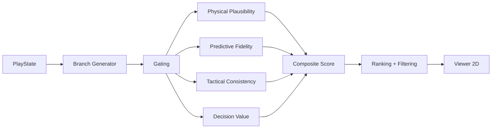

# Documento de Design — Migração de Domínio para Futebol (Soccer)

## Visão Geral

Esta migração transforma o codebase do projeto "soccerfuture" do domínio de futebol americano para o domínio de futebol (association football/soccer). A arquitetura do pipeline permanece inalterada — gating → validity → opportunity → ranking → visualização. Trata-se de uma migração de terminologia, constantes, modelos de dados e lógica de domínio, sem mudanças arquiteturais.

A migração afeta 7 camadas do sistema:
1. **Constantes globais** (`src/utils/constants.py`) — dimensões, limiares, tipos de evento
2. **Modelos de dados** (`src/models/`) — PlayState, Branch, EvaluationReport/SubMetrics
3. **Módulos de scoring** (`src/scoring/`) — gating, plausibilidade, consistência tática, valor de decisão
4. **Geração de branches** (`src/generation/branch_generator.py`) — vetores de movimento, eventos
5. **Visualização** (`src/viewer/`) — campo FIFA, constantes visuais
6. **Dados de demonstração** (`data/play_states/`) — 3 novos cenários de futebol
7. **Testes e estratégias** (`tests/`) — strategies.py e todos os arquivos de teste

## Arquitetura

A arquitetura do pipeline não muda. O fluxo permanece:



A independência entre módulos de scoring é preservada. Cada módulo importa apenas de `src/utils/constants.py` e `src/models/`, nunca de outros módulos de scoring.

### Estratégia de Migração

A migração segue uma abordagem bottom-up:
1. Primeiro: constantes e modelos (base de tudo)
2. Segundo: módulos de scoring (dependem de constantes/modelos)
3. Terceiro: gerador de branches (depende de constantes/modelos)
4. Quarto: viewer (depende de constantes)
5. Quinto: dados de demonstração (dependem de modelos)
6. Sexto: testes e estratégias (dependem de tudo acima)
7. Sétimo: documentação de steering

## Componentes e Interfaces

### 1. Constantes Globais (`src/utils/constants.py`)

**Mudanças:**
- `FIELD_LENGTH`: 100.0 → 105.0 (metros)
- `FIELD_WIDTH`: 53.33 → 68.0 (metros)
- Remover `END_ZONE_DEPTH`
- Adicionar: `PENALTY_AREA_LENGTH = 16.5`, `PENALTY_AREA_WIDTH = 40.3`, `GOAL_AREA_LENGTH = 5.5`, `GOAL_AREA_WIDTH = 18.3`, `CENTER_CIRCLE_RADIUS = 9.15`, `CORNER_ARC_RADIUS = 1.0`
- `MAX_HUMAN_SPRINT_SPEED`: 12.0 → 10.0 (m/s)
- `MAX_ACCELERATION`: 8.0 → 7.0 (m/s², calibrado para futebol)
- `MAX_DECELERATION`: 10.0 → 8.0 (m/s², calibrado para futebol)
- `CONTACT_SPEED_THRESHOLD`: 25.0 → 15.0 (m/s, ajustado para contato no futebol)
- `CONTACT_EVENT_TYPES`: `{"sack", "tackle", "hit", "block", "fumble"}` → `{"tackle", "foul", "dispossession"}`
- `MAX_FORMATION_AREA`: atualizar para `FIELD_WIDTH * 40.0` (2720.0 m²)
- Atualizar todos os comentários de "yards" para "metros"

### 2. PlayState (`src/models/play_state.py`)

**Campos removidos:** `field_position`, `down`, `distance`

**Campos adicionados:** `match_time` (float, 0–90+), `possession_team` (str), `ball_position` (dict com x, y), `game_phase` (str: open_play | set_piece | transition | dead_ball)

**Campos mantidos:** `score_differential`, `game_clock`, `player_positions`, `decision_point_timestamp`, `player_roles`, `metadata`

**Interface atualizada:**
```python
@dataclass
class PlayState:
    match_time: float           # minutos (0–90+)
    possession_team: str        # nome do time com posse
    ball_position: dict         # {"x": float, "y": float} em metros
    game_phase: str             # open_play | set_piece | transition | dead_ball
    score_differential: int
    game_clock: float           # segundos restantes
    player_positions: list[PlayerPosition]
    decision_point_timestamp: float
    player_roles: dict[str, str] = field(default_factory=dict)
    metadata: dict = field(default_factory=dict)
```

**Serialização:** `play_state_to_dict` e `dict_to_play_state` atualizados para os novos campos. Validação de campos obrigatórios atualizada para: `match_time`, `possession_team`, `ball_position`, `game_phase`, `score_differential`, `game_clock`, `player_positions`, `decision_point_timestamp`.

### 3. Branch e EventMarker (`src/models/branch.py`)

**Mudanças:**
- Docstrings atualizadas: "yards" → "metros", event types de futebol
- `PlayerPosition`: docstring atualizada para metros
- `EventMarker`: docstring atualizada com tipos de evento de futebol

### 4. EvaluationReport/SubMetrics (`src/models/evaluation_report.py`)

**Mudanças:**
- `yard_gain_differential` → `ball_progression` (progressão da bola em metros)
- `line_integrity_score` → `formation_shape_score` (forma da formação tática)
- Docstrings atualizadas

### 5. Gating (`src/scoring/gating.py`)

**Mudanças:**
- `_check_field_bounds`: limites atualizados para x ∈ [0, 68], y ∈ [0, 105] (sem end zones)
- `_check_max_speed`: usa `MAX_HUMAN_SPRINT_SPEED = 10.0 m/s` e `CONTACT_SPEED_THRESHOLD = 15.0 m/s`
- Mensagens de explicação: "yd/s" → "m/s", "yards" → "meters"
- Remover importação de `END_ZONE_DEPTH`

### 6. Physical Plausibility (`src/scoring/physical_plausibility.py`)

**Mudanças:**
- Usa limiares em m/s (já importa de constants.py, então muda automaticamente)
- Docstrings e comentários: "yards" → "metros", "yd/s" → "m/s"
- Curva de scoring ajustada: velocidades de 7–9 m/s são comuns no futebol

### 7. Tactical Consistency (`src/scoring/tactical_consistency.py`)

**Mudanças:**
- `_ROLE_ZONES`: novas zonas para GK, CB, LB, RB, CDM, CM, CAM, LW, RW, ST
- Remover zonas de: QB, WR, RB (running back), TE, OL, DL, LB (linebacker), CB (cornerback), S, K, P
- `line_integrity_score` → `formation_shape_score`: avalia manutenção da forma da formação (4-3-3, 4-4-2, etc.)
- `_compute_defensive_density`: eventos de ball carrier atualizados para `{"dribble", "pass_received", "reception"}`
- Papéis defensivos: `{"DL", "LB", "CB", "S"}` → `{"CB", "LB", "RB", "CDM"}`
- Fallback de key player: QB → GK (goleiro não é key player ofensivo) → ST (atacante)
- Pesos do aggregate atualizados para incluir `formation_shape_score`

### 8. Decision Value (`src/scoring/decision_value.py`)

**Mudanças:**
- `yard_gain_differential` → `ball_progression`: mede progressão em metros direção ao gol
- `_MAX_YARD_RANGE` → `_MAX_METER_RANGE = 105.0` (FIELD_LENGTH)
- Turnover types: `{"fumble", "interception", "turnover", "turnover_on_downs"}` → `{"interception", "dispossession"}`
- Scoring types: `{"touchdown", "field_goal", "safety", "scoring_play"}` → `{"goal"}`
- `DecisionValueResult`: `yard_gain_differential` → `ball_progression`
- Docstrings atualizadas

### 9. Branch Generator (`src/generation/branch_generator.py`)

**Mudanças:**
- `_ROLE_BASE_VECTORS`: novos vetores para posições de futebol
  - GK: (0.0, 0.1) — movimentação mínima
  - CB: (0.0, 0.3) — cobertura central
  - LB: (-0.3, 0.7) — subida lateral esquerda
  - RB: (0.3, 0.7) — subida lateral direita
  - CDM: (0.0, 0.4) — cobertura central
  - CM: (0.1, 0.6) — box-to-box
  - CAM: (0.0, 0.8) — movimentação ofensiva
  - LW: (-0.4, 0.8) — corrida pela ponta esquerda
  - RW: (0.4, 0.8) — corrida pela ponta direita
  - ST: (0.0, 0.9) — movimentação na área
- Limites de campo: sem `END_ZONE_DEPTH`, y ∈ [0, 105]
- `_decision_events`: gera pass, dribble, shot em vez de throw, catch, handoff
- `_decision_vector`: ajustado para táticas de futebol (pass play → passe, run play → drible)
- `_find_role_player`: busca ST, CM, LW em vez de QB, WR, RB
- `_default_events`: gera "kick_off" ou "pass" em vez de "snap"

### 10. Viewer 2D (`src/viewer/viewer_2d.py`)

**Mudanças:**
- `draw_field`: renderiza campo FIFA (áreas de penalidade, áreas de gol, círculo central, linha do meio-campo, arcos de escanteio, gols)
- Remover: end zones, yard lines, hashmarks
- Remover: `draw_scrimmage_and_first_down`
- Adicionar: `draw_ball_position(ax, ball_position)` — marca a posição da bola
- `draw_scenario_info`: exibe match_time, possession_team, game_phase
- `render_pipeline_report`: usa `draw_ball_position` em vez de `draw_scrimmage_and_first_down`

### 11. Viewer Constants (`src/viewer/constants.py`)

**Mudanças:**
- `FIELD_LENGTH_YARDS` → `FIELD_LENGTH_M = 105.0`
- `FIELD_WIDTH_YARDS` → `FIELD_WIDTH_M = 68.0`
- Remover: `END_ZONE_DEPTH_YARDS`, `END_ZONE_COLOR`, `SCRIMMAGE_LINE_COLOR`, `FIRST_DOWN_LINE_COLOR`, `YARD_LINE_WIDTH`, `YARD_LABEL_FONTSIZE`
- Adicionar: `PENALTY_AREA_COLOR`, `GOAL_AREA_COLOR`, `CENTER_CIRCLE_COLOR`, `MIDFIELD_LINE_WIDTH`, `BALL_MARKER_SIZE`, `BALL_MARKER_COLOR`
- `ROLE_COLORS`: mapear GK, CB, LB, RB, CDM, CM, CAM, LW, RW, ST

### 12. Cenários de Demonstração (`data/play_states/`)

**Remover:** `first_and_ten_midfield.json`, `second_and_long_after_sack.json`, `third_and_short_goal_line.json`

**Adicionar:**
- `counter_attack_midfield.json`: formação 4-3-3, match_time ~45min, game_phase "transition", ball_position no meio-campo
- `build_up_from_defense.json`: formação 4-4-2, match_time ~15min, game_phase "open_play", ball_position no terço defensivo
- `set_piece_penalty_area.json`: posicionamento de falta, match_time ~75min, game_phase "set_piece", ball_position próxima à área de penalidade

### 13. Render Viewer Script (`scripts/render_viewer.py`)

**Mudanças:**
- `DEMO_SCENARIOS`: atualizar para os 3 novos arquivos JSON de futebol

## Modelos de Dados

### PlayState (atualizado)

```python
@dataclass
class PlayState:
    match_time: float           # 0–90+ minutos
    possession_team: str        # "home" | "away" | nome do time
    ball_position: dict         # {"x": float, "y": float} metros
    game_phase: str             # "open_play" | "set_piece" | "transition" | "dead_ball"
    score_differential: int     # gols próprios - gols adversários
    game_clock: float           # segundos restantes (0–5400+)
    player_positions: list[PlayerPosition]
    decision_point_timestamp: float
    player_roles: dict[str, str] = field(default_factory=dict)
    metadata: dict = field(default_factory=dict)
```

### SubMetrics (atualizado)

```python
@dataclass
class SubMetrics:
    speed_score: float = 0.0
    acceleration_score: float = 0.0
    deceleration_score: float = 0.0
    position_accuracy: float = 0.0
    event_timing_accuracy: float = 0.0
    formation_consistency: float = 0.0
    role_consistency_score: float = 0.0
    formation_coherence_score: float = 0.0
    ball_progression: float = 0.0          # era yard_gain_differential
    turnover_risk_delta: float = 0.0
    scoring_probability_delta: float = 0.0
    alignment_residual: float = 0.0
    plausibility_score: float = 0.0
    fidelity_score: float = 0.0
    tactical_consistency_score: float = 0.0
    decision_value_score: float = 0.0
    compactness_score: float = 0.0
    defensive_density_score: float = 0.0
    formation_shape_score: float = 0.0     # era line_integrity_score
    branch_window_similarity: float = 0.0
```

### DecisionValueResult (atualizado)

```python
@dataclass
class DecisionValueResult:
    opportunity_score: float
    ball_progression: float          # era yard_gain_differential
    turnover_risk_delta: float
    scoring_probability_delta: float
```

### TacticalConsistencyResult (atualizado)

```python
@dataclass
class TacticalConsistencyResult:
    consistency_score: float
    role_consistency_score: float
    formation_coherence_score: float
    compactness_score: float
    defensive_density_score: float
    formation_shape_score: float     # era line_integrity_score
```

### Constantes do Campo de Futebol

```python
# Dimensões do campo (metros)
FIELD_LENGTH: float = 105.0
FIELD_WIDTH: float = 68.0

# Áreas do campo
PENALTY_AREA_LENGTH: float = 16.5
PENALTY_AREA_WIDTH: float = 40.3
GOAL_AREA_LENGTH: float = 5.5
GOAL_AREA_WIDTH: float = 18.3
CENTER_CIRCLE_RADIUS: float = 9.15
CORNER_ARC_RADIUS: float = 1.0

# Limiares físicos (metros/segundo)
MAX_HUMAN_SPRINT_SPEED: float = 10.0
MAX_ACCELERATION: float = 7.0
MAX_DECELERATION: float = 8.0
CONTACT_SPEED_THRESHOLD: float = 15.0

# Eventos de contato
CONTACT_EVENT_TYPES: frozenset[str] = frozenset({"tackle", "foul", "dispossession"})
```

### Papéis de Jogador de Futebol

```python
SOCCER_ROLES = ["GK", "CB", "LB", "RB", "CDM", "CM", "CAM", "LW", "RW", "ST"]
```

### Zonas Posicionais (_ROLE_ZONES)

| Posição | Zona X (metros) | Zona Y (metros) | Descrição |
|---------|-----------------|-----------------|-----------|
| GK | 24–44 (central) | 0–10 (gol próprio) | Próximo ao gol |
| CB | 14–54 (central ampla) | 0–35 (terço defensivo) | Zona central defensiva |
| LB | 0–20 (lateral esquerda) | 0–60 (metade defensiva+) | Lateral esquerdo |
| RB | 48–68 (lateral direita) | 0–60 (metade defensiva+) | Lateral direito |
| CDM | 20–48 (central) | 25–55 (meio-campo) | Volante |
| CM | 14–54 (central ampla) | 20–70 (meio-campo amplo) | Meio-campista |
| CAM | 14–54 (central ampla) | 45–85 (meio ofensivo) | Meia-atacante |
| LW | 0–25 (lateral esquerda) | 50–105 (metade ofensiva) | Ponta esquerda |
| RW | 43–68 (lateral direita) | 50–105 (metade ofensiva) | Ponta direita |
| ST | 14–54 (central ampla) | 65–105 (terço ofensivo) | Atacante |

## Propriedades de Corretude

*Uma propriedade é uma característica ou comportamento que deve ser verdadeiro em todas as execuções válidas de um sistema — essencialmente, uma declaração formal sobre o que o sistema deve fazer. Propriedades servem como ponte entre especificações legíveis por humanos e garantias de corretude verificáveis por máquina.*


### Property 1: PlayState round-trip serialization

*For any* valid PlayState with soccer fields (match_time, possession_team, ball_position, game_phase, score_differential, game_clock, player_positions, decision_point_timestamp, player_roles), converting to dict via `play_state_to_dict` and reconstructing via `dict_to_play_state` shall produce an equivalent PlayState object.

**Validates: Requirements 3.4**

### Property 2: PlayState validation rejects missing soccer fields

*For any* dict that is missing at least one of the required soccer fields (match_time, possession_team, ball_position, game_phase, score_differential, game_clock, player_positions, decision_point_timestamp), `dict_to_play_state` shall raise a KeyError.

**Validates: Requirements 3.5**

### Property 3: Gating validates soccer field bounds without end zones

*For any* branch with player positions, the field bounds gate shall pass if and only if all positions have x ∈ [0, 68] and y ∈ [0, 105]. There are no end zones — positions with y < 0 or y > 105 shall fail the gate.

**Validates: Requirements 1.4, 5.5**

### Property 4: Gating and plausibility use meters-per-second speed thresholds

*For any* branch where a player's speed between consecutive positions exceeds 10.0 m/s (without contact context) or 15.0 m/s (with contact context), the speed gate shall fail. The plausibility module shall assign a speed_score of 0.0 for players exceeding 10.0 m/s.

**Validates: Requirements 5.4, 5.5**

### Property 5: Generated branches contain only soccer events

*For any* PlayState with valid soccer roles, all events in branches produced by `generate_branches` shall have event_type from the soccer event set (pass, shot, tackle, interception, dribble, cross, header, goal, corner_kick, free_kick, throw_in, goal_kick, offside, foul, save, clearance, dispossession).

**Validates: Requirements 4.4, 10.2**

### Property 6: Generated branches respect soccer field bounds and speed limits

*For any* PlayState with valid soccer roles and positions within field bounds, all positions in branches produced by `generate_branches` shall have x ∈ [0, 68] and y ∈ [0, 105], and no player shall exceed `MAX_HUMAN_SPRINT_SPEED * SPEED_SAFETY_FACTOR` (8.5 m/s) between consecutive snapshots.

**Validates: Requirements 10.3, 10.4**

### Property 7: Tactical zone checks are consistent for soccer positions

*For any* soccer role and position within the field, the role zone check shall return a consistent result: positions within the defined zone for that role shall not be flagged as violations, and positions outside the zone shall be flagged.

**Validates: Requirements 6.1**

### Property 8: Ball progression measures forward progress in meters

*For any* branch with player positions, ball_progression shall equal the normalized difference between the branch's average forward displacement (in meters toward y=105) and the window's average yard gain, scaled by FIELD_LENGTH (105.0). A branch with greater forward progress than reality shall have ball_progression > 0.5.

**Validates: Requirements 7.1, 7.4**

### Property 9: Turnover detection uses soccer events

*For any* branch containing "interception" or "dispossession" events, the turnover_risk_delta shall reflect elevated turnover risk (value < 0.5 relative to a zero-turnover window). Branches with no turnover events shall have turnover_risk_delta ≥ 0.5.

**Validates: Requirements 7.2**

## Tratamento de Erros

A estratégia de tratamento de erros permanece inalterada pela migração:

- **Gating failures**: Mensagens de explicação atualizadas para usar metros em vez de yards. Formato: `"Player {id} at t={ts} has x={x} outside field bounds [0, 68.0]"`.
- **PlayState validation**: `KeyError` para campos obrigatórios ausentes, com mensagem listando os campos faltantes.
- **Branch generation**: `ValueError` para `n` fora de [10, 30]. Sem mudança na lógica.
- **Pipeline errors**: Captura de exceções por branch, log e continuação. Sem mudança na lógica.
- **Viewer errors**: `ValueError` para `ranked_branches` vazio, `IndexError` para `branch_index` fora de range. Sem mudança.

## Estratégia de Testes

### Abordagem Dual

- **Testes unitários**: Verificam exemplos específicos, edge cases e condições de erro
- **Testes de propriedade**: Verificam propriedades universais em todos os inputs válidos

### Testes de Propriedade (Property-Based Testing)

Biblioteca: `hypothesis` (já em uso no projeto)

Configuração:
- Mínimo 100 iterações por teste de propriedade
- Cada teste referencia a propriedade do design document
- Tag format: **Feature: soccer-domain-migration, Property {number}: {property_text}**

Propriedades a implementar:
1. PlayState round-trip serialization (Property 1)
2. PlayState validation rejects missing fields (Property 2)
3. Gating field bounds without end zones (Property 3)
4. Speed thresholds in m/s (Property 4)
5. Generated events are soccer events (Property 5)
6. Generated positions within soccer bounds (Property 6)
7. Tactical zone checks for soccer positions (Property 7)
8. Ball progression in meters (Property 8)
9. Turnover detection with soccer events (Property 9)

### Testes Unitários

- **Constantes**: Verificar valores específicos (FIELD_LENGTH=105.0, FIELD_WIDTH=68.0, etc.)
- **Viewer**: Verificar renderização de elementos FIFA (áreas de penalidade, círculo central)
- **Cenários demo**: Verificar que os 3 novos JSONs carregam corretamente
- **Steering docs**: Verificar que referências a "football" foram atualizadas

### Atualização de Estratégias de Teste (`tests/strategies.py`)

- `play_state_strategy()`: gerar PlayStates com campos de futebol
- `_PLAYER_ROLES`: atualizar para `["GK", "CB", "LB", "RB", "CDM", "CM", "CAM", "LW", "RW", "ST"]`
- `valid_positions_strategy()`: limites x ∈ [0, 68], y ∈ [0, 105] (sem END_ZONE_DEPTH)
- `out_of_bounds_branch_strategy()`: sem end zones, violações em x<0, x>68, y<0, y>105
- `evaluation_report_dict_strategy()`: `ball_progression` em vez de `yard_gain_differential`, `formation_shape_score` em vez de `line_integrity_score`
