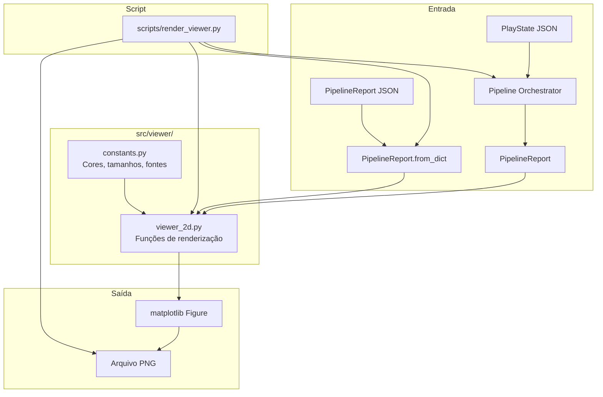
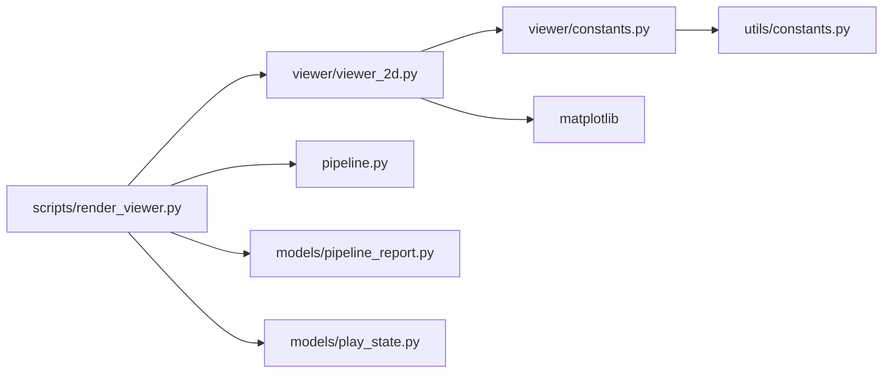
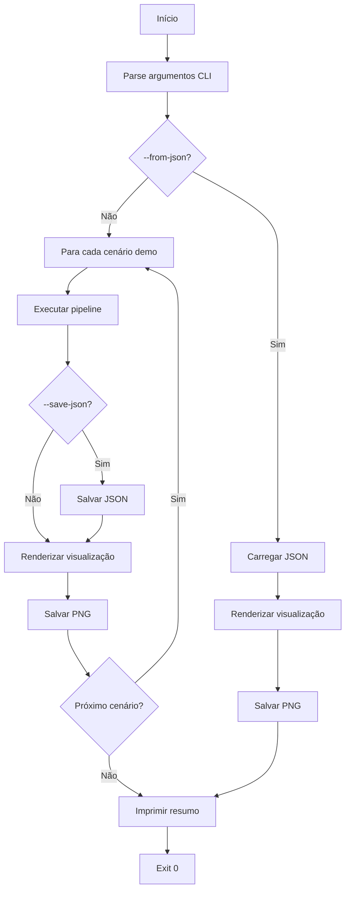

# Design Document: Viewer 2D

## Overview

Este design descreve o módulo de visualização 2D (`src/viewer/`) que renderiza a saída do pipeline (`PipelineReport`) em imagens de campo de futebol americano usando `matplotlib`. O viewer é uma ferramenta de inspeção pura — consome dados já produzidos pelo pipeline sem introduzir lógica de scoring nem modificar modelos existentes.

O módulo é composto por três camadas de renderização independentes:

1. **Campo base** — Desenha o campo regulamentar (100 × 53.33 jardas), end zones, linhas de 10 jardas, hashmarks, line of scrimmage e first-down line.
2. **Branches e jogadores** — Renderiza posições iniciais dos jogadores (diferenciadas por role) e trajetórias dos top-K branches (diferenciadas por cor).
3. **Painéis informativos** — Exibe explicação de ranking, telemetria do pipeline e informações contextuais do cenário.

Cada camada é implementada como funções puras que recebem dados e retornam/modificam objetos `matplotlib.figure.Figure` e `matplotlib.axes.Axes`. Nenhuma função realiza I/O de filesystem ou executa o pipeline.

Um script de orquestração (`scripts/render_viewer.py`) conecta o pipeline aos módulos de renderização, gerando imagens PNG para os 3 cenários demo. O script suporta `--from-json` para carregar relatórios pré-salvos e `--save-json` para persistir relatórios antes da renderização.

Restrições de design:
- Sem dependências novas além de `matplotlib` (já presente no projeto).
- Constantes visuais centralizadas em `src/viewer/constants.py` — sem valores mágicos nas funções de renderização.
- Funções pequenas e single-purpose (~40 linhas máximo), seguindo o padrão do projeto.
- Toda saída é determinística para os mesmos dados de entrada (sem randomização visual).
- O módulo é importável sem efeitos colaterais.

## Architecture

### Integração de Alto Nível



### Separação de Camadas

| Camada | Localização | Responsabilidade |
|--------|-------------|------------------|
| Constantes visuais | `src/viewer/constants.py` | Cores por role, cores por branch, tamanhos, fontes |
| Renderização do campo | `src/viewer/viewer_2d.py` | Desenho do campo base, linhas, end zones |
| Renderização de branches | `src/viewer/viewer_2d.py` | Posições iniciais, trajetórias, setas direcionais |
| Renderização de painéis | `src/viewer/viewer_2d.py` | Explicação de ranking, telemetria, contexto do cenário |
| Script de orquestração | `scripts/render_viewer.py` | Execução do pipeline, I/O de arquivos, CLI |

### Grafo de Dependências



O módulo `src/viewer/` não importa de `src/scoring/`, `src/explainability.py` nem de `src/telemetry.py`. Recebe dados já processados como dicts via `PipelineReport`.

## Components and Interfaces

### 1. Constantes Visuais — `src/viewer/constants.py`

Centraliza todas as constantes visuais usadas pelas funções de renderização. Importa dimensões do campo de `src/utils/constants.py` para manter consistência.

```python
from src.utils.constants import FIELD_LENGTH, FIELD_WIDTH, END_ZONE_DEPTH

# --- Dimensões do campo ---
FIELD_LENGTH_YARDS: float = FIELD_LENGTH   # 100.0
FIELD_WIDTH_YARDS: float = FIELD_WIDTH     # 53.33
END_ZONE_DEPTH_YARDS: float = END_ZONE_DEPTH  # 10.0

# --- Cores por role de jogador ---
ROLE_COLORS: dict[str, str] = {
    "QB": "#E63946",   # vermelho
    "WR": "#457B9D",   # azul
    "RB": "#2A9D8F",   # verde-azulado
    "TE": "#E9C46A",   # amarelo
    "OL": "#264653",   # cinza-escuro
}
DEFAULT_ROLE_COLOR: str = "#888888"

# --- Cores para top-K branches ---
BRANCH_COLORS: list[str] = [
    "#1F77B4",  # azul
    "#FF7F0E",  # laranja
    "#2CA02C",  # verde
    "#D62728",  # vermelho
    "#9467BD",  # roxo
    "#8C564B",  # marrom
    "#E377C2",  # rosa
]

# --- Tamanhos de marcadores ---
PLAYER_MARKER_SIZE: float = 80.0
PLAYER_MARKER_SINGLE: float = 120.0  # branch individual (maior destaque)
PLAYER_LABEL_FONTSIZE: int = 6
TRAJECTORY_LINE_WIDTH: float = 1.5
TRAJECTORY_LINE_WIDTH_SINGLE: float = 2.5  # branch individual
ARROW_HEAD_WIDTH: float = 0.8
ARROW_HEAD_LENGTH: float = 0.6

# --- Cores do campo ---
FIELD_COLOR: str = "#2E7D32"
END_ZONE_COLOR: str = "#1B5E20"
LINE_COLOR: str = "#FFFFFF"
SCRIMMAGE_LINE_COLOR: str = "#FFD700"
FIRST_DOWN_LINE_COLOR: str = "#FF6600"
YARD_LABEL_FONTSIZE: int = 8
YARD_LINE_WIDTH: float = 0.5
SCRIMMAGE_LINE_WIDTH: float = 2.0

# --- Layout da figura ---
FIGURE_WIDTH: float = 16.0
FIGURE_HEIGHT: float = 10.0
FIELD_AXES_RECT: list[float] = [0.02, 0.05, 0.55, 0.85]
EXPLANATION_AXES_RECT: list[float] = [0.60, 0.40, 0.38, 0.55]
TELEMETRY_AXES_RECT: list[float] = [0.60, 0.05, 0.38, 0.30]

# --- Fontes ---
TITLE_FONTSIZE: int = 12
PANEL_TITLE_FONTSIZE: int = 10
PANEL_TEXT_FONTSIZE: int = 8
```

### 2. Módulo de Renderização — `src/viewer/viewer_2d.py`

Funções puras que recebem dados e retornam/modificam objetos matplotlib. Organizadas em três grupos: campo, branches/jogadores, e painéis.

#### Funções de Campo

```python
import matplotlib.pyplot as plt
import matplotlib.figure
import matplotlib.axes
from src.viewer.constants import *


def draw_field(ax: matplotlib.axes.Axes) -> None:
    """Desenha o campo de futebol americano regulamentar no axes fornecido.

    Renderiza o retângulo do campo (100 × 53.33 jardas), end zones,
    linhas de 10 jardas com rótulos numéricos, e hashmarks centrais.

    Args:
        ax: Axes do matplotlib onde o campo será desenhado.
    """


def draw_scrimmage_and_first_down(
    ax: matplotlib.axes.Axes,
    field_position: float,
    distance: float,
) -> None:
    """Desenha a line of scrimmage e a first-down line no campo.

    Args:
        ax: Axes do matplotlib com o campo já desenhado.
        field_position: Posição em jardas a partir da própria end zone (0-100).
        distance: Jardas até o first down.
    """
```

#### Funções de Jogadores e Branches

```python
def draw_player_positions(
    ax: matplotlib.axes.Axes,
    player_positions: list[dict],
    player_roles: dict[str, str],
) -> None:
    """Renderiza as posições iniciais dos jogadores no campo.

    Cada jogador é desenhado como um marcador colorido por role,
    com o player_id como rótulo. Adiciona uma legenda de roles.

    Args:
        ax: Axes do matplotlib com o campo já desenhado.
        player_positions: Lista de dicts com keys player_id, x, y.
        player_roles: Mapeamento player_id → role string.
    """


def draw_branches(
    ax: matplotlib.axes.Axes,
    ranked_branches: list[dict],
) -> None:
    """Renderiza as trajetórias dos top-K branches sobrepostas no campo.

    Cada branch recebe uma cor distinta. Para cada jogador em cada branch,
    desenha segmentos conectando posições ordenadas por timestamp,
    com setas indicando direção. Adiciona legenda com branch_id e
    composite_score.

    Args:
        ax: Axes do matplotlib com o campo e jogadores já desenhados.
        ranked_branches: Lista de dicts de RankedBranch (via to_dict()).
    """


def draw_single_branch(
    ax: matplotlib.axes.Axes,
    ranked_branch: dict,
    color: str,
) -> None:
    """Renderiza um único branch com destaque visual ampliado.

    Usa marcadores maiores e linhas mais espessas que draw_branches.
    Destinado à visualização individual de um branch específico.

    Args:
        ax: Axes do matplotlib com o campo já desenhado.
        ranked_branch: Dict de um RankedBranch.
        color: Cor a usar para as trajetórias.
    """
```

#### Funções de Painéis

```python
def draw_scenario_info(
    fig: matplotlib.figure.Figure,
    play_state: dict,
) -> None:
    """Renderiza as informações contextuais do cenário como título da figura.

    Exibe down & distance, posição no campo, diferencial de placar,
    e opcionalmente formação e descrição do cenário.

    Args:
        fig: Figure do matplotlib.
        play_state: Dict do PlayState (via play_state_to_dict).
    """


def draw_explanation_panel(
    ax: matplotlib.axes.Axes,
    ranked_branches: list[dict],
) -> None:
    """Renderiza o painel de explicação de ranking para os top-K branches.

    Para cada branch, exibe: branch_id, validity_score, opportunity_score,
    composite_score, promoted_factors, penalized_factors,
    top/bottom_scoring_block, e near_threshold_warning se presente.

    Args:
        ax: Axes do matplotlib dedicado ao painel de explicação.
        ranked_branches: Lista de dicts de RankedBranch.
    """


def draw_telemetry_panel(
    ax: matplotlib.axes.Axes,
    metadata: dict,
) -> None:
    """Renderiza o painel de telemetria do pipeline.

    Exibe branches_generated, hard_fail_count, score_filtered_count,
    avg_score_by_strategy, e time_per_stage. Se telemetria não estiver
    disponível, exibe mensagem indicativa.

    Args:
        ax: Axes do matplotlib dedicado ao painel de telemetria.
        metadata: Dict de metadata do PipelineReport.
    """
```

#### Funções de Composição

```python
def render_pipeline_report(
    report_dict: dict,
) -> matplotlib.figure.Figure:
    """Renderiza uma visualização completa de um PipelineReport.

    Compõe campo + posições iniciais + top-K branches + painel de
    explicação + painel de telemetria + informações do cenário em
    uma única figura matplotlib.

    Args:
        report_dict: Dict do PipelineReport (via to_dict()).

    Returns:
        Figure do matplotlib com a visualização completa.
    """


def render_single_branch(
    report_dict: dict,
    branch_index: int,
) -> matplotlib.figure.Figure:
    """Renderiza uma visualização focada em um único branch do top-K.

    Exibe o campo com as trajetórias do branch selecionado em destaque,
    e a explicação de ranking completa ao lado.

    Args:
        report_dict: Dict do PipelineReport (via to_dict()).
        branch_index: Índice (0-based) do branch no ranked_branches.

    Returns:
        Figure do matplotlib com a visualização do branch individual.

    Raises:
        IndexError: Se branch_index está fora do range de ranked_branches.
        ValueError: Se ranked_branches está vazio.
    """
```


### 3. Script de Orquestração — `scripts/render_viewer.py`

Script CLI que conecta o pipeline ao viewer. Suporta execução direta do pipeline ou carregamento de relatórios JSON pré-salvos.

```python
"""Gera visualizações 2D para os cenários demo do pipeline.

Executa o pipeline nos 3 cenários demo e salva imagens PNG em output/viewer/.
Suporta carregamento de PipelineReport JSON pré-salvo e salvamento de
relatórios gerados.

Usage:
    python scripts/render_viewer.py
    python scripts/render_viewer.py --from-json output/report.json
    python scripts/render_viewer.py --save-json output/report.json

Exit codes:
    0: Sucesso — todas as visualizações geradas.
    1: Falha em qualquer cenário.
"""
import argparse
import json
import sys
from pathlib import Path


DEMO_SCENARIOS: list[str] = [
    "data/play_states/first_and_ten_midfield.json",
    "data/play_states/third_and_short_goal_line.json",
    "data/play_states/second_and_long_after_sack.json",
]

OUTPUT_DIR: str = "output/viewer"


def load_report_from_json(path: str) -> dict:
    """Carrega um PipelineReport dict de um arquivo JSON.

    Args:
        path: Caminho para o arquivo JSON.

    Returns:
        Dict do PipelineReport.

    Raises:
        FileNotFoundError: Se o arquivo não existe.
        json.JSONDecodeError: Se o JSON é inválido.
    """


def save_report_to_json(report_dict: dict, path: str) -> None:
    """Salva um PipelineReport dict como JSON com indentação de 2 espaços.

    Args:
        report_dict: Dict do PipelineReport (via to_dict()).
        path: Caminho de saída.
    """


def run_scenario(scenario_file: str) -> dict:
    """Executa o pipeline para um cenário e retorna o report dict.

    Args:
        scenario_file: Caminho para o arquivo JSON do PlayState.

    Returns:
        Dict do PipelineReport (via to_dict()).
    """


def main() -> None:
    """Entry point: parseia argumentos, gera visualizações, imprime resumo."""
```

#### Fluxo do Script



## Data Models

### Estruturas Consumidas (modelos existentes — sem modificação)

O viewer consome exclusivamente dados já produzidos pelo pipeline. Nenhum modelo existente é modificado.

#### PipelineReport dict (via `to_dict()`)

```json
{
  "play_state": {
    "field_position": 50.0,
    "down": 1,
    "distance": 10.0,
    "score_differential": 0,
    "game_clock": 900.0,
    "player_positions": [
      {"player_id": "QB1", "x": 26.66, "y": 49.0, "timestamp": 1.5}
    ],
    "decision_point_timestamp": 1.5,
    "player_roles": {"QB1": "QB", "WR1": "WR"},
    "metadata": {"formation": "shotgun", "description": "1st-and-10 at midfield"}
  },
  "ranked_branches": [
    {
      "branch_id": "gen-001",
      "composite_score": 0.62,
      "evaluation_report": {
        "validity_score": 0.78,
        "opportunity_score": 0.46,
        "ranking_explanation": {
          "promoted_factors": ["Physical Speed", "Position Accuracy"],
          "penalized_factors": ["Turnover Risk"],
          "top_scoring_block": "Physical Speed",
          "bottom_scoring_block": "Turnover Risk",
          "near_threshold_warning": null
        }
      },
      "branch": {
        "branch_id": "gen-001",
        "positions": [
          {"player_id": "QB1", "x": 26.66, "y": 52.0, "timestamp": 2.0},
          {"player_id": "QB1", "x": 27.0, "y": 55.0, "timestamp": 2.5}
        ],
        "player_roles": {"QB1": "QB", "WR1": "WR"}
      }
    }
  ],
  "metadata": {
    "telemetry": {
      "branches_generated": 20,
      "hard_fail_count": 3,
      "score_filtered_count": 2,
      "avg_score_by_strategy": {"route_variation": 0.45},
      "time_per_stage": {"generation": 0.12, "evaluation": 1.85, "ranking": 0.01}
    }
  },
  "evaluated_branches": [],
  "errors": []
}
```

### Constantes Visuais (novo — `src/viewer/constants.py`)

Definidas na seção de Components acima. Centralizam todas as configurações visuais:
- `ROLE_COLORS` — mapeamento role → cor hex para marcadores de jogadores.
- `BRANCH_COLORS` — lista de cores hex para diferenciar top-K branches.
- Tamanhos de marcadores, espessuras de linhas, fontes, e layout da figura.

### Coordenadas do Campo

O sistema de coordenadas do viewer segue o modelo existente de `PlayerPosition`:
- **x**: Jardas a partir da sideline esquerda (0 a 53.33).
- **y**: Jardas a partir da própria end zone (0 a 100).

O axes do matplotlib mapeia diretamente: `ax.set_xlim(0, FIELD_WIDTH_YARDS)` e `ax.set_ylim(0, FIELD_LENGTH_YARDS)`. End zones são desenhadas como retângulos adicionais abaixo de y=0 e acima de y=100.

